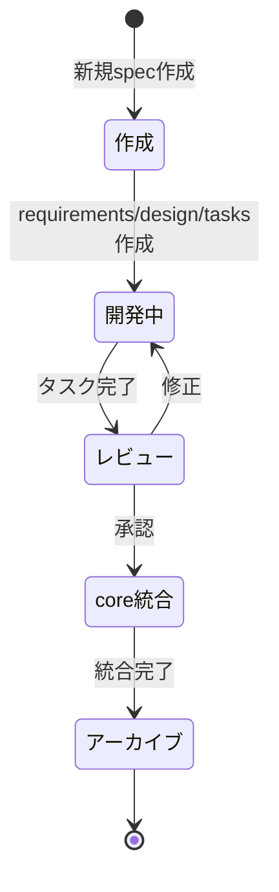

# Spec管理体系

## 概要

このディレクトリは、Janlogアプリケーションの仕様（Spec）を体系的に管理します。統合仕様（core/）を中心に、新機能追加（features/）、開発改善（improvements/）、バグ修正（bugfix/）をカテゴリ別に管理し、完了後はアーカイブ（archive/）で履歴を保持します。

## ディレクトリ構造

```
.kiro/specs/
├── README.md                          # 本ファイル（spec管理体系の全体説明）
├── core/                              # 統合仕様（マスター）
│   ├── requirements.md                # 全体要件の統合版
│   ├── design.md                      # 全体設計の統合版
│   └── architecture.md                # システム全体のアーキテクチャ
├── features/                          # 新機能追加spec
│   └── {feature-name}/                # 個別機能spec
│       ├── requirements.md
│       ├── design.md
│       └── tasks.md
├── improvements/                      # 開発改善spec
│   ├── makefile-improvements/         # Makefile改善
│   ├── backend-test-data-management/  # テストデータ管理
│   └── spec-management/               # Spec管理体系整理
├── bugfix/                            # バグ修正spec
│   └── react-native-buffer-polyfill/  # Buffer polyfill修正
└── archive/                           # 完了したspec
    └── mahjong-score-management/      # 初期MVP（参照用）
```

## 各カテゴリの役割

### core/ - 統合仕様（Single Source of Truth）

**役割**: プロジェクト全体の「正」の仕様を一元管理

**ファイル構成**:
- `requirements.md`: 全体要件の統合版
- `design.md`: 全体設計の統合版
- `architecture.md`: システム全体のアーキテクチャ

**更新タイミング**:
- 新機能完了時に該当セクションを追加
- アーキテクチャ変更時に更新
- 既存セクションは変更せず、新規セクションを追加

**参照方法**:
```
「core/requirements.mdを参照して実装」
```

### features/ - 新機能追加Spec

**役割**: 新機能の要件・設計・実装タスクを管理

**対象**:
- 会場管理機能
- 画像OCR機能
- 共有ルーム機能
- 詳細統計グラフ

**運用フロー**:
1. `features/{feature-name}/`を作成
2. requirements.md → design.md → tasks.md の順で作成
3. タスク実行
4. 完了後、core/に統合
5. archive/に移動

**Core統合**: 必須

### improvements/ - 開発改善Spec

**役割**: 開発環境改善、ツール追加、テスト基盤整備

**対象**:
- ローカル開発環境の改善
- ツール・スクリプト追加
- テストデータ管理
- CI/CD改善
- ドキュメント整備

**運用フロー**:
1. `improvements/{improvement-name}/`を作成
2. requirements.md → design.md → tasks.md の順で作成
3. タスク実行
4. 完了後、core/統合（任意）
5. archive/に移動

**Core統合**: 任意（アーキテクチャに影響する場合のみ）

### bugfix/ - バグ修正Spec

**役割**: バグ修正、緊急対応、セキュリティパッチ

**対象**:
- バグ修正
- 緊急対応
- セキュリティパッチ
- 環境依存の問題修正

**運用フロー**:
1. `bugfix/{bug-name}/`を作成
2. requirements.md（バグの現象・原因・修正要件）作成
3. design.md（修正方針・実装方法）作成
4. tasks.md作成・実行
5. 完了後、core/更新（必要に応じて）
6. archive/に移動

**Core統合**: 必要に応じて（設計の根本的な問題の場合のみ）

### archive/ - 完了したSpec

**役割**: 完了したspecの履歴保持、過去の意思決定の参照

**活用方法**:
- 過去の実装パターンの参照
- 新規メンバーのオンボーディング資料
- トラブルシューティングの参考
- 類似機能開発時の参考

**参照方法**:
```
「archive/mahjong-score-managementの設計を参照して」
```

## Specのライフサイクル



## Kiroへの指示方法

### 新規Spec作成

```
「会場管理機能の新機能specを作成して」
→ features/venue-management/を作成し、requirements.md作成から開始

「Makefileの改善specを作成して」
→ improvements/makefile-improvements/を作成

「認証エラーのバグ修正specを作成して」
→ bugfix/cognito-auth-error/を作成
```

### タスク実行

```
「features/venue-managementのタスク3を実行」
「improvements/makefile-improvementsのタスク1を実行」
「bugfix/cognito-auth-errorのタスク2を実行」
```

### Core統合仕様を参照した実装

```
「core/requirements.mdを参照して、対局登録機能を実装して」
「core/design.mdのデータモデルに従って実装して」
```

### Core統合

```
「features/venue-managementをcore/に統合して」
→ core/requirements.mdとcore/design.mdに該当セクションを追加
```

### Archive参照

```
「archive/mahjong-score-managementの設計を参照して」
→ 過去のspecを参照して実装
```

## 命名規則

### ディレクトリ名
- **形式**: kebab-case
- **例**: `venue-management`, `makefile-improvements`, `react-native-buffer-polyfill`

### ファイル名
- `requirements.md`: 要件書
- `design.md`: 設計書
- `tasks.md`: 実装タスク

## Core統合の判断基準

### 必ず統合が必要
- ✅ 新機能追加（features/）
- ✅ アーキテクチャ変更を伴う改善
- ✅ データモデル変更を伴う修正
- ✅ API仕様変更を伴う修正

### 統合不要
- ❌ ローカル開発環境の改善
- ❌ 個別ツール・スクリプトの追加
- ❌ テストデータ管理
- ❌ 単純なバグ修正
- ❌ 環境依存の問題修正

### 判断が必要
- ⚠️ 開発フローの標準化
- ⚠️ テスト基盤の整備
- ⚠️ CI/CD改善
- ⚠️ ドキュメント整備

## Steering経由での自動参照

`.kiro/steering/spec-management.md`に設定することで、Kiroが自動的にcore/配下の仕様を参照します。

**自動参照されるファイル**:
- `core/requirements.md`
- `core/design.md`
- `core/architecture.md`

## 運用の原則

### Single Source of Truth
- **core/が常に最新**: 全ての機能追加・変更はcore/に反映
- **詳細は個別specに**: core/は概要のみ、詳細は個別specに記載
- **履歴はarchiveに**: 完了したspecはarchiveで参照可能

### 段階的統合
- **手動マージ**: 機能完了後に手動でcore/にマージ
- **自動マージなし**: 自動マージは行わない（整合性確保のため）
- **影響範囲確認**: 既存機能への影響を慎重に確認

### Git履歴の保持
- **git mv使用**: spec移動時はgit mvで履歴を保持
- **コミットメッセージ**: 移動理由を明記

### ドキュメントの保守
- **生きたドキュメント**: core/は常に最新の状態を保つ
- **定期的な見直し**: 古い情報は更新または削除
- **参照リンクの確認**: ファイル移動時は参照リンクを更新

## トラブルシューティング

### Specが見つからない
1. `.kiro/specs/`配下の全ディレクトリを確認
2. archiveに移動していないか確認
3. Git履歴で移動履歴を確認

```bash
# 特定specの検索
find .kiro/specs -name "*venue*"

# Git履歴で移動を確認
git log --follow .kiro/specs/archive/{spec-name}/
```

### Core統合の判断に迷う
1. 影響範囲を確認（アーキテクチャ、データモデル、API仕様）
2. 他の開発者への影響を考慮
3. 迷ったら統合する方向で判断

### 既存specとの整合性
1. core/の該当セクションを確認
2. 既存設計との矛盾がないか確認
3. 必要に応じて設計変更のspecを作成

## 関連ドキュメント

- **Steering設定**: `.kiro/steering/spec-management.md`
- **Core統合仕様**: `.kiro/specs/core/`
- **ADR**: `/spec/adr/`
- **プロジェクトコンテキスト**: `/spec/context.md`
- **OpenAPI仕様**: `/spec/openapi.yaml`

## 初期化履歴

- **2025年**: spec-management実装により体系化
- **初期内容**: mahjong-score-management（初期MVP仕様）をベースにcore/を作成
