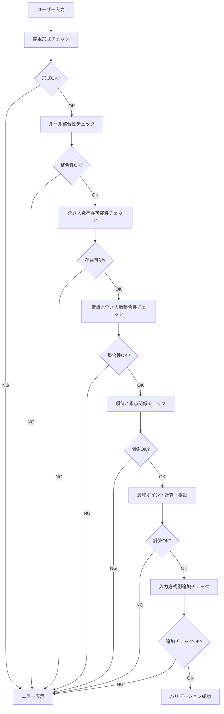

# 対局データ包括的バリデーション - 設計書

## Overview

対局データの入力時に、単一項目と複数項目を組み合わせた包括的なバリデーションを実装します。既存の`spec/design/match-validation.md`の複合バリデーション設計を基に、フロントエンド（TypeScript）とバックエンド（Python）の両方で同等のバリデーションロジックを実装します。

### 設計目標

1. **データ整合性の保証**: 麻雀成績として論理的にありえない状態を検出
2. **ユーザー体験の向上**: 明確なエラーメッセージで修正方法を提示
3. **二重バリデーション**: フロントエンドとバックエンドで同等のチェック
4. **保守性**: バリデーションルールを一元管理し、テストで網羅
5. **拡張性**: 新しいルールやバリデーションを追加しやすい設計

### 既存実装の状況

**フロントエンド:**
- `frontend/src/hooks/useMatchForm.ts`に基本的な単一項目バリデーションが実装済み
- `validateRank`, `validateFinalPoints`, `validateRawScore`, `validateFloatingCount`, `validateMatchDate`関数が存在
- 複合バリデーションは未実装

**バックエンド:**
- `backend/app/models/match.py`のPydanticモデルに基本的なバリデーションが実装済み
- `@field_validator`と`@model_validator`で単一項目と一部の複合チェックを実施
- 浮きウマ関連の複合バリデーションは未実装

## Architecture

### バリデーション階層

```
┌─────────────────────────────────────────┐
│  UI Layer (React Components)           │
│  - リアルタイムバリデーション表示      │
│  - エラーメッセージ表示                │
└─────────────────┬───────────────────────┘
                  │
┌─────────────────▼───────────────────────┐
│  Validation Layer (Frontend)           │
│  - MatchValidator クラス                │
│  - 単一項目バリデーション              │
│  - 複合バリデーション                  │
└─────────────────┬───────────────────────┘
                  │ API Request
┌─────────────────▼───────────────────────┐
│  API Layer (Backend)                    │
│  - Pydantic モデルバリデーション       │
│  - カスタムバリデーター                │
└─────────────────┬───────────────────────┘
                  │
┌─────────────────▼───────────────────────┐
│  Validation Layer (Backend)             │
│  - MatchValidator クラス                │
│  - 単一項目バリデーション              │
│  - 複合バリデーション                  │
└─────────────────────────────────────────┘
```


### バリデーション実行フロー



## Components and Interfaces

### 1. フロントエンド: MatchValidator クラス

**ファイル:** `frontend/src/utils/matchValidator.ts`

**責務:**
- 対局データの包括的バリデーション
- エラーメッセージの生成
- バリデーション結果の返却

**インターフェース:**

```typescript
// バリデーション結果
interface ValidationResult {
  isValid: boolean;
  errors: ValidationError[];
}

interface ValidationError {
  field: string;
  code: string;
  message: string;
  severity: 'error' | 'warning';
}

// バリデーション対象データ
interface MatchValidationInput {
  date: string;
  gameMode: 'three' | 'four';
  entryMethod: 'rank_plus_points' | 'rank_plus_raw' | 'provisional_rank_only';
  rank: number;
  finalPoints?: number;
  rawScore?: number;
  floatingCount?: number;
  ruleset: Ruleset;
}

class MatchValidator {
  // 包括的バリデーション
  static validate(input: MatchValidationInput): ValidationResult;
  
  // 単一項目バリデーション
  static validateDate(date: string): ValidationResult;
  static validateRank(rank: number, gameMode: string): ValidationResult;
  static validateFinalPoints(points: number): ValidationResult;
  static validateRawScore(score: number): ValidationResult;
  static validateFloatingCount(count: number, gameMode: string): ValidationResult;
  
  // 複合バリデーション
  static validateEntryMethodConsistency(input: MatchValidationInput): ValidationResult;
  static validateFloatingCountExistence(input: MatchValidationInput): ValidationResult;
  static validateRawScoreFloatingConsistency(input: MatchValidationInput): ValidationResult;
  static validateRankRawScoreRelation(input: MatchValidationInput): ValidationResult;
  static validateFinalPointsConsistency(input: MatchValidationInput): ValidationResult;
  static validateTopPointsMinimum(input: MatchValidationInput): ValidationResult;
}
```


### 2. バックエンド: MatchValidator クラス

**ファイル:** `backend/app/utils/match_validator.py`

**責務:**
- 対局データの包括的バリデーション
- Pydanticモデルと連携
- エラーメッセージの生成

**インターフェース:**

```python
from typing import List, Dict, Any, Optional
from pydantic import BaseModel

class ValidationError(BaseModel):
    """バリデーションエラー"""
    field: str
    code: str
    message: str
    severity: str  # 'error' | 'warning'

class ValidationResult(BaseModel):
    """バリデーション結果"""
    is_valid: bool
    errors: List[ValidationError]

class MatchValidator:
    """対局データバリデーター"""
    
    @staticmethod
    def validate(
        date: str,
        game_mode: str,
        entry_method: str,
        rank: int,
        ruleset: Ruleset,
        final_points: Optional[float] = None,
        raw_score: Optional[int] = None,
        floating_count: Optional[int] = None
    ) -> ValidationResult:
        """包括的バリデーション"""
        pass
    
    @staticmethod
    def validate_date(date: str) -> ValidationResult:
        """日付バリデーション"""
        pass
    
    @staticmethod
    def validate_rank(rank: int, game_mode: str) -> ValidationResult:
        """順位バリデーション"""
        pass
    
    @staticmethod
    def validate_final_points(points: float) -> ValidationResult:
        """最終ポイントバリデーション"""
        pass
    
    @staticmethod
    def validate_raw_score(score: int) -> ValidationResult:
        """素点バリデーション"""
        pass
    
    @staticmethod
    def validate_floating_count(count: int, game_mode: str) -> ValidationResult:
        """浮き人数バリデーション"""
        pass
    
    @staticmethod
    def validate_entry_method_consistency(
        entry_method: str,
        ruleset: Ruleset,
        final_points: Optional[float],
        raw_score: Optional[int],
        floating_count: Optional[int]
    ) -> ValidationResult:
        """入力方式とルールの整合性バリデーション"""
        pass
    
    @staticmethod
    def validate_floating_count_existence(
        ruleset: Ruleset,
        floating_count: Optional[int]
    ) -> ValidationResult:
        """浮き人数の存在可能性バリデーション"""
        pass
    
    @staticmethod
    def validate_raw_score_floating_consistency(
        raw_score: int,
        floating_count: int,
        ruleset: Ruleset
    ) -> ValidationResult:
        """素点と浮き人数の整合性バリデーション"""
        pass
    
    @staticmethod
    def validate_rank_raw_score_relation(
        rank: int,
        raw_score: int,
        floating_count: int,
        game_mode: str,
        ruleset: Ruleset
    ) -> ValidationResult:
        """順位と素点の関係バリデーション"""
        pass
    
    @staticmethod
    def validate_final_points_consistency(
        rank: int,
        raw_score: int,
        floating_count: Optional[int],
        final_points: float,
        ruleset: Ruleset
    ) -> ValidationResult:
        """最終ポイントとルールの整合性バリデーション"""
        pass
    
    @staticmethod
    def validate_top_points_minimum(
        rank: int,
        final_points: float,
        floating_count: Optional[int],
        ruleset: Ruleset
    ) -> ValidationResult:
        """トップの最終ポイント下限バリデーション"""
        pass
```


### 3. エラーコード体系

バリデーションエラーには一意のエラーコードを割り当て、フロントエンドとバックエンドで統一します。

```typescript
// エラーコード定義
enum ValidationErrorCode {
  // 基本形式エラー (E-00系)
  INVALID_DATE_FORMAT = 'E-00-01',
  FUTURE_DATE = 'E-00-02',
  TOO_OLD_DATE = 'E-00-03',
  INVALID_RANK = 'E-00-04',
  INVALID_FINAL_POINTS_RANGE = 'E-00-05',
  INVALID_FINAL_POINTS_PRECISION = 'E-00-06',
  INVALID_RAW_SCORE_RANGE = 'E-00-07',
  INVALID_RAW_SCORE_UNIT = 'E-00-08',
  INVALID_CHIP_COUNT = 'E-00-09',
  INVALID_FLOATING_COUNT_RANGE = 'E-00-10',
  
  // 入力方式とルールの整合性エラー (E-01系)
  FLOATING_COUNT_WITH_FIXED_UMA = 'E-01-01',
  MISSING_FLOATING_COUNT = 'E-01-02',
  MISSING_FINAL_POINTS = 'E-01-03',
  MISSING_RAW_SCORE = 'E-01-04',
  
  // 浮き人数の存在可能性エラー (E-10系)
  IMPOSSIBLE_ZERO_FLOATING = 'E-10-01',
  IMPOSSIBLE_ALL_FLOATING = 'E-10-02',
  INVALID_FLOATING_COUNT_RANGE_FOR_RULE = 'E-10-03',
  
  // 素点と浮き人数の整合性エラー (E-20系)
  FLOATING_SCORE_WITH_ZERO_COUNT = 'E-20-01',
  SINKING_SCORE_WITH_ALL_FLOATING = 'E-20-02',
  INCONSISTENT_FLOATING_COUNT_WITH_EQUAL_POINTS = 'E-20-03',
  INCONSISTENT_FLOATING_COUNT_WITH_LOWER_START = 'E-20-04',
  
  // 順位と素点の関係エラー (E-30系)
  TOP_RANK_SINKING_WITH_FLOATING = 'E-30-01',
  LAST_RANK_FLOATING_WITHOUT_ALL_FLOATING = 'E-30-02',
  LAST_RANK_FLOATING_WITH_LOWER_START = 'E-30-03',
  ALL_FLOATING_WITH_SINKING_SCORE = 'E-30-04',
  ALL_SINKING_WITH_FLOATING_SCORE = 'E-30-05',
  
  // 最終ポイントとルールの整合性エラー (E-40系)
  UMA_NOT_DEFINED = 'E-40-01',
  CALCULATED_POINTS_OUT_OF_RANGE = 'E-40-02',
  CALCULATED_POINTS_PRECISION_ERROR = 'E-40-03',
  
  // トップの最終ポイント下限エラー (E-43系)
  TOP_POINTS_BELOW_MINIMUM = 'E-43-01',
}
```


## Data Models

### バリデーション仕様データ

既存の`spec/design/match-validation.md`をバリデーション仕様の正式ドキュメントとして使用します。このファイルには以下の情報が含まれます：

1. **記号・前提**: バリデーションで使用する変数と関数の定義
2. **ルール構造と入力形式の整合**: E-00, E-01系のエラー定義
3. **浮き人数の存在可能性**: E-10系のエラー定義
4. **自分の素点と浮き人数の整合**: E-20系のエラー定義
5. **順位と素点の関係**: E-30系のエラー定義
6. **最終ポイントとルールの整合**: E-40系のエラー定義
7. **実装ガイド**: バリデーション実行順序
8. **運用設計**: Mode別の注意事項

### エラーメッセージマッピング

各エラーコードに対して、日本語のエラーメッセージと修正ヒントを定義します。

```typescript
// エラーメッセージ定義
const ERROR_MESSAGES: Record<ValidationErrorCode, { message: string; hint: string }> = {
  [ValidationErrorCode.INVALID_DATE_FORMAT]: {
    message: '日付の形式が正しくありません',
    hint: 'YYYY-MM-DD形式で入力してください'
  },
  [ValidationErrorCode.FUTURE_DATE]: {
    message: '未来の日付は選択できません',
    hint: '今日以前の日付を選択してください'
  },
  [ValidationErrorCode.TOO_OLD_DATE]: {
    message: '5年以上前の日付は選択できません',
    hint: '直近5年以内の日付を選択してください'
  },
  [ValidationErrorCode.FLOATING_COUNT_WITH_ZERO_COUNT]: {
    message: '自分が浮いているのに浮き人数が0人になっています',
    hint: '浮き人数を1人以上に修正してください'
  },
  [ValidationErrorCode.TOP_RANK_SINKING_WITH_FLOATING]: {
    message: '1位なのに素点が基準点未満です（浮き人数が1人以上の場合、1位は必ず浮きます）',
    hint: '素点または順位を確認してください'
  },
  [ValidationErrorCode.TOP_POINTS_BELOW_MINIMUM]: {
    message: '1位の最終ポイントがルール上の最小値を下回っています',
    hint: `最終ポイントは{minPoints}以上である必要があります`
  },
  // ... 他のエラーメッセージ
};
```

## Error Handling

### フロントエンドのエラー表示

1. **リアルタイムバリデーション**: 入力中に基本形式チェックを実施
2. **フォーカスアウト時バリデーション**: 項目を離れた時に複合バリデーションを実施
3. **送信時バリデーション**: 全てのバリデーションを実施してエラーを一覧表示
4. **エラー強調表示**: エラーがある項目を赤枠で強調
5. **エラーメッセージ表示**: 各項目の下にエラーメッセージとヒントを表示

### バックエンドのエラーレスポンス

```json
{
  "detail": {
    "message": "バリデーションエラーが発生しました",
    "errors": [
      {
        "field": "floatingCount",
        "code": "E-20-01",
        "message": "自分が浮いているのに浮き人数が0人になっています",
        "severity": "error"
      },
      {
        "field": "rank",
        "code": "E-30-01",
        "message": "1位なのに素点が基準点未満です",
        "severity": "error"
      }
    ]
  }
}
```

HTTPステータスコード: `400 Bad Request`


## Testing Strategy

### テストカバレッジ目標

- **単体テスト**: 各バリデーション関数のカバレッジ100%
- **統合テスト**: 複合バリデーションのカバレッジ90%以上
- **E2Eテスト**: 主要な入力パターンのカバレッジ80%以上

### テストケース分類

#### 1. 単一項目バリデーションテスト

各項目について正常系・異常系・境界値のテストケースを作成します。

**日付バリデーション:**
- 正常系: 今日の日付、1週間前、1年前
- 異常系: 未来の日付、5年以上前、不正な形式
- 境界値: 今日、5年前の今日

**順位バリデーション:**
- 正常系: 1位、2位、3位、4位（ゲームモード別）
- 異常系: 0位、5位、負の値
- 境界値: 3麻で3位、4麻で4位

**最終ポイントバリデーション:**
- 正常系: 0.0、50.5、-50.5
- 異常系: 1000.0、-1000.0、小数第2位
- 境界値: 999.9、-999.9、0.1

**素点バリデーション:**
- 正常系: 25000、52300、-10000
- 異常系: 25050（下2桁が00でない）、1000000（範囲外）
- 境界値: 999900、-999900、0

**浮き人数バリデーション:**
- 正常系: 0人、1人、2人、3人、4人（ゲームモード別）
- 異常系: -1人、5人
- 境界値: 3麻で3人、4麻で4人

#### 2. 複合バリデーションテスト

複数項目の組み合わせによる矛盾を検出するテストケースを作成します。

**浮き人数の存在可能性テスト:**

| 開始点 | 基準点 | 浮き人数 | 期待結果 | エラーコード |
|--------|--------|----------|----------|--------------|
| 25000  | 25000  | 0        | エラー   | E-10-01      |
| 25000  | 25000  | 1        | OK       | -            |
| 25000  | 30000  | 4        | エラー   | E-10-02      |
| 25000  | 30000  | 3        | OK       | -            |

**素点と浮き人数の整合性テスト:**

| 素点   | 基準点 | 浮き人数 | 期待結果 | エラーコード |
|--------|--------|----------|----------|--------------|
| 30000  | 25000  | 0        | エラー   | E-20-01      |
| 30000  | 25000  | 1        | OK       | -            |
| 20000  | 25000  | 4        | エラー   | E-20-02      |
| 20000  | 25000  | 3        | OK       | -            |

**順位と素点の関係テスト:**

| 順位 | 素点   | 基準点 | 浮き人数 | 期待結果 | エラーコード |
|------|--------|--------|----------|----------|--------------|
| 1    | 20000  | 25000  | 1        | エラー   | E-30-01      |
| 1    | 30000  | 25000  | 1        | OK       | -            |
| 4    | 30000  | 25000  | 3        | エラー   | E-30-02      |
| 4    | 20000  | 25000  | 3        | OK       | -            |

**トップの最終ポイント下限テスト:**

| 順位 | 最終ポイント | トップウマ | トップオカ | 期待結果 | エラーコード |
|------|--------------|------------|------------|----------|--------------|
| 1    | 40.0         | 30         | 20         | エラー   | E-43-01      |
| 1    | 50.0         | 30         | 20         | OK       | -            |
| 1    | 49.9         | 30         | 20         | エラー   | E-43-01      |

#### 3. 入力方式別テスト

**Mode 1（順位+最終ポイント）:**
- 固定ウマルールでの正常入力
- 浮きウマルールでの正常入力（浮き人数なし）
- トップの最終ポイント下限チェック

**Mode 2（順位+素点）:**
- 固定ウマルールでの正常入力
- 浮きウマルールでの正常入力（浮き人数あり）
- 素点と浮き人数の整合性チェック
- 順位と素点の関係チェック
- 計算された最終ポイントの検証

**Mode 3（仮ポイント）:**
- 固定ウマルールでの正常入力
- 浮きウマルールでの正常入力（浮き人数あり）
- 仮ポイント計算の検証


### テストファイル構成

**フロントエンド:**
```
frontend/src/utils/__tests__/
├── matchValidator.test.ts           # MatchValidatorクラスのテスト
├── matchValidator.single.test.ts    # 単一項目バリデーションテスト
├── matchValidator.composite.test.ts # 複合バリデーションテスト
└── matchValidator.entryMethod.test.ts # 入力方式別テスト
```

**バックエンド:**
```
backend/tests/utils/
├── test_match_validator.py           # MatchValidatorクラスのテスト
├── test_match_validator_single.py    # 単一項目バリデーションテスト
├── test_match_validator_composite.py # 複合バリデーションテスト
└── test_match_validator_entry_method.py # 入力方式別テスト
```

### テストデータ管理

テストで使用するルールセットデータを共通化します。

**フロントエンド:**
```typescript
// frontend/src/utils/__tests__/fixtures/rulesets.ts
export const FIXED_UMA_RULESET_4: Ruleset = {
  rulesetId: 'test-fixed-4',
  ruleName: 'テスト用固定ウマ（4麻）',
  gameMode: 'four',
  startingPoints: 25000,
  basePoints: 30000,
  useFloatingUma: false,
  uma: [30, 10, -10, -30],
  oka: 20,
  // ...
};

export const FLOATING_UMA_RULESET_4: Ruleset = {
  rulesetId: 'test-floating-4',
  ruleName: 'テスト用浮きウマ（4麻）',
  gameMode: 'four',
  startingPoints: 25000,
  basePoints: 30000,
  useFloatingUma: true,
  uma: [], // 使用しない
  umaMatrix: {
    '1': [40, 20, -20, -40],
    '2': [35, 15, -15, -35],
    '3': [30, 10, -10, -30],
  },
  oka: 20,
  // ...
};
```

**バックエンド:**
```python
# backend/tests/fixtures/rulesets.py
FIXED_UMA_RULESET_4 = {
    "rulesetId": "test-fixed-4",
    "ruleName": "テスト用固定ウマ（4麻）",
    "gameMode": "four",
    "startingPoints": 25000,
    "basePoints": 30000,
    "useFloatingUma": False,
    "uma": [30, 10, -10, -30],
    "oka": 20,
    # ...
}

FLOATING_UMA_RULESET_4 = {
    "rulesetId": "test-floating-4",
    "ruleName": "テスト用浮きウマ（4麻）",
    "gameMode": "four",
    "startingPoints": 25000,
    "basePoints": 30000,
    "useFloatingUma": True,
    "uma": [],  # 使用しない
    "umaMatrix": {
        "1": [40, 20, -20, -40],
        "2": [35, 15, -15, -35],
        "3": [30, 10, -10, -30],
    },
    "oka": 20,
    # ...
}
```

## Implementation Details

### バリデーション実行順序

`spec/design/match-validation.md`の「6) 実装ガイド（順番）」に従って実装します：

1. **基本形式チェック**: 型・桁数・範囲の検証
2. **ルール整合**: 浮きウマか固定ウマか、ウマの存在確認
3. **浮き人数の存在可能性**: 開始点・基準点との関係
4. **素点と浮き人数の整合**: 自分の素点と浮き人数の矛盾チェック
5. **順位と素点の境界矛盾**: 明らかな矛盾の検出
6. **最終ポイント計算・形式**: 計算結果の妥当性検証
7. **入力方式別の追加チェック**: Mode別の特殊ルール

### 既存コードとの統合

**フロントエンド:**
- `useMatchForm.ts`の既存バリデーション関数を`MatchValidator`クラスに移行
- 既存の`validateRank`等の関数は`MatchValidator`のメソッドとして再実装
- `useMatchForm`フックは`MatchValidator.validate()`を呼び出すように変更

**バックエンド:**
- `match.py`の`@model_validator`を`MatchValidator`クラスに移行
- Pydanticモデルは基本的な型チェックのみを実施
- 複合バリデーションは`MatchValidator.validate()`で実施
- APIエンドポイントで明示的に`MatchValidator.validate()`を呼び出し

### パフォーマンス考慮事項

1. **早期リターン**: エラーが見つかった時点で後続のチェックをスキップ（オプション）
2. **キャッシュ**: ルールセット情報のキャッシュ（頻繁に参照される場合）
3. **非同期処理**: フロントエンドでのデバウンス処理（リアルタイムバリデーション）

### 国際化対応（将来）

現在は日本語のみですが、将来的に多言語対応する場合：

```typescript
// エラーメッセージの国際化
const ERROR_MESSAGES_I18N = {
  ja: {
    [ValidationErrorCode.FUTURE_DATE]: {
      message: '未来の日付は選択できません',
      hint: '今日以前の日付を選択してください'
    }
  },
  en: {
    [ValidationErrorCode.FUTURE_DATE]: {
      message: 'Future dates cannot be selected',
      hint: 'Please select a date on or before today'
    }
  }
};
```


## Design Decisions and Rationale

### 1. バリデーションロジックの分離

**決定:** バリデーションロジックを専用のクラス（`MatchValidator`）に分離

**理由:**
- Pydanticモデルやフックに直接実装すると、複雑な複合バリデーションが読みにくくなる
- テストが容易になる（モデルやフックに依存しない単体テスト）
- フロントエンドとバックエンドで同じ構造を維持できる
- 将来的なバリデーションルールの追加・変更が容易

### 2. エラーコード体系の導入

**決定:** 各バリデーションエラーに一意のエラーコードを割り当て

**理由:**
- フロントエンドとバックエンドでエラーを一意に識別できる
- エラーメッセージの国際化が容易
- ログやモニタリングでエラーを追跡しやすい
- ドキュメント（`spec/design/match-validation.md`）との対応が明確

### 3. 二重バリデーションの実施

**決定:** フロントエンドとバックエンドの両方でバリデーションを実施

**理由:**
- フロントエンド: ユーザー体験の向上（即座にエラーを表示）
- バックエンド: セキュリティとデータ整合性の保証（フロントエンドのバイパス対策）
- 両方で同じロジックを実装することで、整合性を保証

### 4. バリデーション実行順序の最適化

**決定:** 基本形式チェックから複合バリデーションへと段階的に実行

**理由:**
- 早期にエラーを検出できる（基本形式が間違っていれば複合チェックは不要）
- エラーメッセージの優先順位が明確（基本的なエラーを先に表示）
- パフォーマンスの向上（不要なチェックをスキップ）

### 5. 警告とエラーの区別

**決定:** バリデーション結果に`severity`フィールドを追加（`error` | `warning`）

**理由:**
- Mode 1（順位+最終ポイント）では「受け入れる」運用だが、警告は表示したい
- 固定ウマルールでの素点と順位の矛盾は警告レベル（エラーではない）
- ユーザーに情報を提供しつつ、送信はブロックしない柔軟性

### 6. 既存の`spec/design/match-validation.md`を正式仕様として使用

**決定:** 新しいドキュメントを作成せず、既存のファイルを拡張・整理

**理由:**
- 既に詳細な複合バリデーション設計が存在する
- 重複を避け、Single Source of Truthを維持
- 実装者が参照するドキュメントを一元化

### 7. テストデータの共通化

**決定:** フロントエンドとバックエンドで同じテストデータ（ルールセット）を使用

**理由:**
- 両方のバリデーションが同じ結果を返すことを保証
- テストケースの保守が容易
- バグの早期発見（片方だけで発生するバグを検出）

## Migration Strategy

### Phase 1: バリデーションクラスの実装

1. `MatchValidator`クラスの実装（フロントエンド・バックエンド）
2. 単一項目バリデーションの移行
3. 単体テストの作成

### Phase 2: 複合バリデーションの実装

1. 浮き人数関連のバリデーション実装
2. 順位と素点の関係バリデーション実装
3. 最終ポイント関連のバリデーション実装
4. 統合テストの作成

### Phase 3: 既存コードとの統合

1. `useMatchForm`フックの更新
2. Pydanticモデルの更新
3. APIエンドポイントの更新
4. E2Eテストの作成

### Phase 4: ドキュメント整備

1. `spec/design/match-validation.md`の更新
2. エラーメッセージ一覧の作成
3. 開発者向けガイドの作成

## Related Documents

- **バリデーション仕様**: `spec/design/match-validation.md`
- **要件定義**: `.kiro/specs/features/comprehensive-match-validation/requirements.md`
- **API仕様**: `spec/openapi.yaml`
- **ルールセットモデル**: `backend/app/models/ruleset.py`
- **対局モデル**: `backend/app/models/match.py`
- **ポイント計算**: `backend/app/utils/point_calculator.py`
