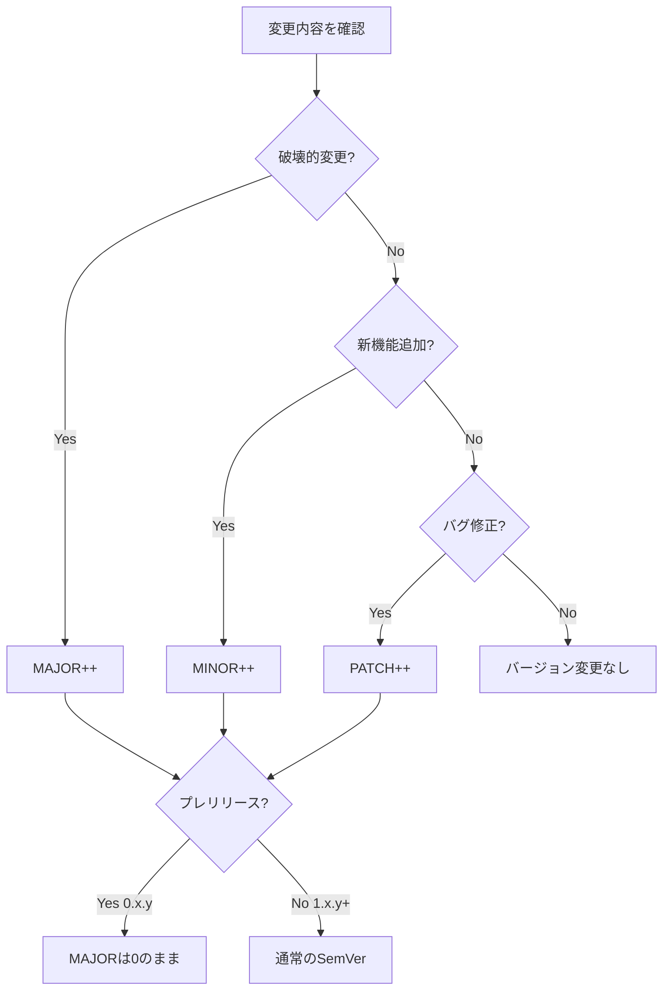

# バージョン管理ルール化 - 設計書

## 概要

Janlogアプリケーションにセマンティックバージョニング（Semantic Versioning 2.0.0）を採用し、フロントエンド、バックエンド、インフラの各サブシステムで統一的なバージョン管理を実現します。バージョン情報をAPIで提供し、アプリ内の設定画面で表示できるようにします。

## アーキテクチャ

### バージョン管理の全体構成

```
┌─────────────────────────────────────────────────────────────┐
│                    Janlog Application                        │
│                    Version: 0.1.0                            │
└─────────────────────────────────────────────────────────────┘
                              │
        ┌─────────────────────┼─────────────────────┐
        │                     │                     │
┌───────▼────────┐   ┌────────▼────────┐   ┌──────▼──────┐
│   Frontend     │   │    Backend      │   │    Infra    │
│   Version:     │   │    Version:     │   │   Version:  │
│   0.1.0        │   │    0.1.0        │   │   0.1.0     │
│                │   │                 │   │             │
│ package.json   │   │ pyproject.toml  │   │package.json │
│ app.json       │   │                 │   │             │
└────────────────┘   └─────────────────┘   └─────────────┘
```

### バージョン情報の流れ

```
┌──────────────┐
│   Frontend   │
│  (Settings)  │
└──────┬───────┘
       │ GET /api/v1/version
       ▼
┌──────────────┐
│   Backend    │
│  /version    │
│  endpoint    │
└──────┬───────┘
       │ Read from
       ▼
┌──────────────┐
│pyproject.toml│
│  [project]   │
│  version =   │
│  "0.1.0"     │
└──────────────┘
```

## コンポーネントと実装

### 1. セマンティックバージョニングルール

#### バージョンフォーマット
```
MAJOR.MINOR.PATCH

例: 0.1.0, 0.2.0, 1.0.0
```

#### バージョンインクリメントルール

**プレリリース段階（0.x.y）:**
- MINOR: 新機能追加時
- PATCH: バグ修正時
- MAJOR: 常に0（本番準備完了まで）

**本番リリース後（1.x.y以降）:**
- MAJOR: 破壊的変更（APIの非互換変更、データモデルの大幅変更）
- MINOR: 後方互換性のある機能追加
- PATCH: 後方互換性のあるバグ修正

#### 判断フローチャート



### 2. サブシステムバージョン管理

#### フロントエンド（frontend/）

**管理ファイル:**
- `package.json`: npmパッケージバージョン
- `app.json`: Expoアプリバージョン、ビルド番号

**package.json:**
```json
{
  "name": "@janlog/frontend",
  "version": "0.1.0",
  "description": "Janlog Frontend - React Native Expo App"
}
```

**app.json:**
```json
{
  "expo": {
    "version": "0.1.0",
    "android": {
      "versionCode": 1
    },
    "ios": {
      "buildNumber": "1"
    }
  }
}
```

**ビルド番号管理:**
- `versionCode` (Android): 単調増加する整数（1, 2, 3, ...）
- `buildNumber` (iOS): 単調増加する整数（1, 2, 3, ...）
- ストア提出時に必ずインクリメント
- セマンティックバージョンとは独立して管理

#### バックエンド（backend/）

**管理ファイル:**
- `pyproject.toml`: Pythonプロジェクトバージョン

**pyproject.toml:**
```toml
[project]
name = "janlog-backend"
version = "0.1.0"
description = "Janlog Backend - FastAPI Lambda Application"
```

**バージョン読み込み:**
```python
# backend/app/version.py
import tomllib
from pathlib import Path

def get_version() -> str:
    """pyproject.tomlからバージョンを読み込む"""
    pyproject_path = Path(__file__).parent.parent / "pyproject.toml"
    with open(pyproject_path, "rb") as f:
        pyproject = tomllib.load(f)
    return pyproject["project"]["version"]

VERSION = get_version()
```

#### インフラストラクチャ（infra/）

**管理ファイル:**
- `package.json`: CDKプロジェクトバージョン

**package.json:**
```json
{
  "name": "@janlog/infra",
  "version": "0.1.0",
  "description": "Janlog Infrastructure - AWS CDK"
}
```

### 3. バージョン情報API

#### エンドポイント設計

**パス:** `GET /health`

**認証:** 不要（公開エンドポイント）

**説明:** 
既存の`/health`エンドポイントにバージョン情報が含まれているため、専用のバージョンエンドポイントは作成しません。これにより、API Gatewayの認証設定を回避し、シンプルな実装を維持できます。

**レスポンス:**
```json
{
  "status": "healthy",
  "timestamp": "2025-01-15T10:30:00Z",
  "version": "0.1.0",
  "environment": "development",
  "services": {
    "dynamodb": "healthy",
    "api": "healthy"
  }
}
```

**レスポンスモデル:**
```python
# backend/app/main.py
class HealthResponse(BaseModel):
    status: str
    timestamp: str
    version: str
    environment: str
    services: Dict[str, str]
```

#### 実装

**backend/app/main.py:**
```python
from app.version import VERSION
from datetime import datetime, timezone

@app.get("/health", response_model=HealthResponse)
async def health_check() -> HealthResponse:
    """
    ヘルスチェックエンドポイント
    アプリケーションとDynamoDBの稼働状況を確認する
    
    バージョン情報も含まれるため、フロントエンドはこのエンドポイントから
    バックエンドのバージョンを取得できます。
    """
    # DynamoDBの接続確認
    dynamodb_client = get_dynamodb_client()
    dynamodb_status = "healthy" if await dynamodb_client.health_check() else "unhealthy"

    # 開発環境では DynamoDB の状態に関係なく API は healthy とする
    if settings.is_development:
        overall_status = "healthy"
    else:
        overall_status = "healthy" if dynamodb_status == "healthy" else "unhealthy"

    return HealthResponse(
        status=overall_status,
        timestamp=datetime.now(timezone.utc).isoformat(),
        version=VERSION,
        environment=settings.ENVIRONMENT,
        services={"dynamodb": dynamodb_status, "api": "healthy"},
    )
```

### 4. アプリ内バージョン表示

#### 設定画面の実装

**画面構成:**
```
┌─────────────────────────────┐
│        設定                  │
├─────────────────────────────┤
│                             │
│  バージョン情報              │
│  ├─ アプリバージョン: v0.1.0│
│  ├─ ビルド番号: 1           │
│  └─ サーバーバージョン:     │
│     v0.1.0                  │
│                             │
│  その他の設定...            │
│                             │
└─────────────────────────────┘
```

**実装場所:**
- `frontend/app/(tabs)/settings.tsx`（既存の設定画面に追加）
- または `frontend/app/(tabs)/profile.tsx`（プロフィール画面に追加）

**バージョン情報の取得:**
```typescript
// frontend/src/hooks/useVersion.ts
import { useState, useEffect } from 'react';
import Constants from 'expo-constants';
import { apiClient } from '@/services/api';

interface VersionInfo {
  appVersion: string;
  buildNumber: string;
  serverVersion: string | null;
}

export function useVersion(): VersionInfo {
  const [serverVersion, setServerVersion] = useState<string | null>(null);

  useEffect(() => {
    const fetchServerVersion = async () => {
      try {
        // /health エンドポイントからバージョン情報を取得
        const response = await apiClient.get('/health');
        setServerVersion(response.data.version);
      } catch (error) {
        console.error('Failed to fetch server version:', error);
        setServerVersion(null);
      }
    };

    fetchServerVersion();
  }, []);

  return {
    appVersion: Constants.expoConfig?.version || 'Unknown',
    buildNumber: Constants.expoConfig?.android?.versionCode?.toString() || 
                 Constants.expoConfig?.ios?.buildNumber || 'Unknown',
    serverVersion,
  };
}
```

**表示コンポーネント:**
```typescript
// frontend/components/VersionInfo.tsx
import React from 'react';
import { View, Text, StyleSheet } from 'react-native';
import { useVersion } from '@/hooks/useVersion';

export function VersionInfo() {
  const { appVersion, buildNumber, serverVersion } = useVersion();

  return (
    <View style={styles.container}>
      <Text style={styles.title}>バージョン情報</Text>
      <View style={styles.row}>
        <Text style={styles.label}>アプリバージョン:</Text>
        <Text style={styles.value}>v{appVersion}</Text>
      </View>
      <View style={styles.row}>
        <Text style={styles.label}>ビルド番号:</Text>
        <Text style={styles.value}>{buildNumber}</Text>
      </View>
      <View style={styles.row}>
        <Text style={styles.label}>サーバーバージョン:</Text>
        <Text style={styles.value}>
          {serverVersion ? `v${serverVersion}` : '不明'}
        </Text>
      </View>
    </View>
  );
}

const styles = StyleSheet.create({
  container: {
    padding: 16,
    backgroundColor: '#f5f5f5',
    borderRadius: 8,
  },
  title: {
    fontSize: 16,
    fontWeight: 'bold',
    marginBottom: 12,
  },
  row: {
    flexDirection: 'row',
    justifyContent: 'space-between',
    marginBottom: 8,
  },
  label: {
    fontSize: 14,
    color: '#666',
  },
  value: {
    fontSize: 14,
    fontWeight: '500',
  },
});
```

### 5. バージョン互換性マトリクス

#### マトリクスフォーマット

**VERSIONING.md内に記載:**
```markdown
## バージョン互換性マトリクス

| アプリバージョン | フロントエンド | バックエンド | インフラ | 互換性 |
|-----------------|--------------|-------------|---------|--------|
| 0.1.0           | 0.1.0        | 0.1.0       | 0.1.0   | ✅     |
| 0.2.0           | 0.2.0        | 0.1.0       | 0.1.0   | ✅     |
| 0.3.0           | 0.3.0        | 0.2.0       | 0.1.0   | ✅     |
| 1.0.0           | 1.0.0        | 1.0.0       | 1.0.0   | ✅     |

### 互換性ルール

- フロントエンドとバックエンドのMINORバージョン差は±1まで互換
- MAJORバージョンが異なる場合は非互換
- インフラバージョンは独立（CDK構成の変更を示す）
```

### 6. リリースプロセス

#### リリースフロー


#### バージョン更新手順

**1. バージョン番号の決定:**
```bash
# 変更内容を確認
git log --oneline v0.1.0..HEAD

# バージョンインクリメントルールに従って決定
# 例: 新機能追加 → 0.1.0 → 0.2.0
```

**2. ファイル更新:**
```bash
# フロントエンド
# frontend/package.json の version を更新
# frontend/app.json の version を更新
# frontend/app.json の versionCode/buildNumber をインクリメント

# バックエンド
# backend/pyproject.toml の version を更新

# インフラ（必要に応じて）
# infra/package.json の version を更新
```

**3. Gitタグ作成:**
```bash
# タグ作成（アプリバージョン = フロントエンドバージョン）
git tag -a v0.2.0 -m "Release version 0.2.0"

# サブシステム別タグ（オプション）
git tag -a frontend/v0.2.0 -m "Frontend version 0.2.0"
git tag -a backend/v0.2.0 -m "Backend version 0.2.0"
git tag -a infra/v0.1.0 -m "Infrastructure version 0.1.0"
```

**4. プッシュ:**
```bash
# コミットとタグをプッシュ
git push origin main
git push origin --tags
```

**5. CI/CDデプロイ:**
- GitHub Actionsが自動的にビルド・デプロイを実行
- タグに基づいてリリースノートを自動生成

## データモデル

### バージョン情報レスポンス

```typescript
interface VersionResponse {
  version: string;        // セマンティックバージョン（例: "0.1.0"）
  apiVersion: string;     // APIバージョン（例: "v1"）
  deployedAt: string;     // デプロイ日時（ISO 8601形式）
  environment: string;    // 環境名（local/development/production）
}
```

### アプリ内バージョン情報

```typescript
interface AppVersionInfo {
  appVersion: string;      // アプリバージョン（例: "0.1.0"）
  buildNumber: string;     // ビルド番号（例: "1"）
  serverVersion: string | null;  // サーバーバージョン（例: "0.1.0"）
}
```

## エラーハンドリング

### バックエンドバージョン取得失敗

**シナリオ:**
- ネットワークエラー
- サーバーダウン
- タイムアウト

**対応:**
```typescript
try {
  // /health エンドポイントからバージョン情報を取得
  const response = await apiClient.get('/health');
  setServerVersion(response.data.version);
} catch (error) {
  console.error('Failed to fetch server version:', error);
  setServerVersion(null);  // "不明"として表示
}
```

### バージョンファイル読み込み失敗

**シナリオ:**
- `pyproject.toml`が存在しない
- フォーマットエラー

**対応:**
```python
def get_version() -> str:
    try:
        pyproject_path = Path(__file__).parent.parent / "pyproject.toml"
        with open(pyproject_path, "rb") as f:
            pyproject = tomllib.load(f)
        return pyproject["project"]["version"]
    except Exception as e:
        logger.error(f"Failed to read version from pyproject.toml: {e}")
        return "unknown"
```

## テスト戦略

### バックエンドテスト

**ユニットテスト:**
```python
# tests/test_version.py
def test_get_version():
    """バージョン取得のテスト"""
    from app.version import get_version
    version = get_version()
    assert version is not None
    assert len(version.split('.')) == 3  # MAJOR.MINOR.PATCH

def test_health_endpoint_includes_version():
    """ヘルスチェックエンドポイントにバージョン情報が含まれることのテスト"""
    response = client.get("/health")
    assert response.status_code == 200
    data = response.json()
    assert "version" in data
    assert "timestamp" in data
    assert "environment" in data
    assert "services" in data
```

### フロントエンドテスト

**ユニットテスト:**
```typescript
// __tests__/hooks/useVersion.test.ts
import { renderHook, waitFor } from '@testing-library/react-native';
import { useVersion } from '@/hooks/useVersion';

describe('useVersion', () => {
  it('should fetch server version', async () => {
    const { result } = renderHook(() => useVersion());
    
    await waitFor(() => {
      expect(result.current.appVersion).toBeDefined();
      expect(result.current.buildNumber).toBeDefined();
    });
  });

  it('should handle server version fetch failure', async () => {
    // Mock API failure
    jest.spyOn(apiClient, 'get').mockRejectedValue(new Error('Network error'));
    
    const { result } = renderHook(() => useVersion());
    
    await waitFor(() => {
      expect(result.current.serverVersion).toBeNull();
    });
  });
});
```

## セキュリティ考慮事項

### バージョン情報の公開

**リスク:**
- バージョン情報から既知の脆弱性を特定される可能性

**対策:**
- `/version`エンドポイントは最小限の情報のみ公開
- 詳細なビルド情報やコミットハッシュは含めない
- 定期的なセキュリティアップデートの実施

### 認証不要エンドポイント

**理由:**
- アプリ起動時にバージョンチェックを行うため
- ログイン前にバージョン互換性を確認するため

**制限:**
- レート制限の適用（API Gateway）
- 機密情報は含めない

## パフォーマンス考慮事項

### バージョン情報のキャッシュ

**フロントエンド:**
```typescript
// 1時間キャッシュ
const CACHE_DURATION = 60 * 60 * 1000;

export function useVersion(): VersionInfo {
  const [serverVersion, setServerVersion] = useState<string | null>(null);
  const [lastFetch, setLastFetch] = useState<number>(0);

  useEffect(() => {
    const now = Date.now();
    if (now - lastFetch < CACHE_DURATION && serverVersion) {
      return;  // キャッシュを使用
    }

    const fetchServerVersion = async () => {
      // ... fetch logic
      setLastFetch(now);
    };

    fetchServerVersion();
  }, []);

  // ...
}
```

**バックエンド:**
- バージョン情報は起動時に一度読み込み
- 環境変数として保持（Lambda環境変数）

## 運用考慮事項

### バージョン管理のベストプラクティス

1. **定期的なリリース:**
   - 2週間に1回のリリースサイクル
   - 緊急バグ修正は随時

2. **変更ログの管理:**
   - `CHANGELOG.md`でバージョンごとの変更を記録
   - GitHub Releasesで自動生成

3. **バージョン互換性の確認:**
   - リリース前に互換性マトリクスを更新
   - 破壊的変更は事前に告知

4. **ロールバック計画:**
   - 各バージョンのGitタグを保持
   - 必要に応じて前バージョンにロールバック可能

## 関連ドキュメント

- [Semantic Versioning 2.0.0](https://semver.org/)
- [Expo Versioning](https://docs.expo.dev/distribution/app-stores/#versioning-your-app)
- [Python Packaging Version Specifiers](https://packaging.python.org/en/latest/specifications/version-specifiers/)
