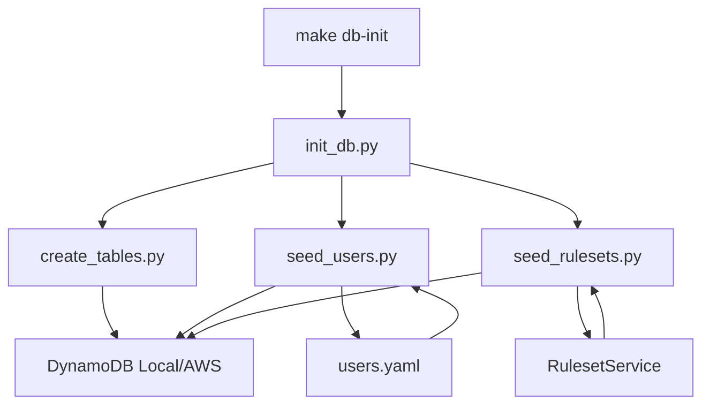

# Design Document

## Overview

バックエンドのテストデータ管理システムを再設計し、保守性・拡張性・環境対応を向上させます。現在のスクリプトは複数の責務を持ち、テストデータがコードに埋め込まれているため、変更が困難です。この設計では、データとロジックを分離し、環境別（local/development）に対応した柔軟なデータベース初期化システムを構築します。

## Architecture

### ディレクトリ構造

```
backend/
├── seeds/                          # Seedデータ（YAMLファイル）
│   ├── users.yaml                  # ユーザーデータ
│   ├── rulesets.yaml               # ルールセット定義（参照用）
│   └── matches.yaml                # サンプル対局データ（将来）
│
├── scripts/
│   ├── db/                         # DB関連スクリプト
│   │   ├── __init__.py
│   │   ├── create_tables.py        # テーブル作成
│   │   ├── seed_users.py           # ユーザーseed投入
│   │   ├── seed_rulesets.py        # ルールセットseed投入
│   │   ├── seed_matches.py         # 対局データseed投入（将来）
│   │   ├── init_db.py              # 統合初期化
│   │   └── utils.py                # 共通ユーティリティ
│   │
│   └── generate_mock_jwt.py        # 既存（そのまま）
│
└── app/
    ├── config/
    │   └── settings.py              # 環境設定
    ├── services/
    │   └── ruleset_service.py       # ルールセットサービス
    └── utils/
        └── dynamodb_utils.py        # DynamoDB操作ユーティリティ
```

### データフロー



## Components and Interfaces

### 1. Seedデータファイル（YAML）

#### users.yaml

```yaml
# backend/seeds/users.yaml
# テストユーザーデータ定義

users:
  # 一般ユーザー
  - userId: test-user-001
    email: test@example.com
    displayName: テストユーザー
    role: user
    
  # 管理者ユーザー
  - userId: test-admin-001
    email: admin@example.com
    displayName: 管理者ユーザー
    role: admin
    
  # 追加テストユーザー
  - userId: test-user-002
    email: test2@example.com
    displayName: テストユーザー2
    role: user
```

#### rulesets.yaml（参照用）

```yaml
# backend/seeds/rulesets.yaml
# ルールセット定義（参照用、実際はコードから生成）
# このファイルは、PointCalculator.get_common_rule_templates()の内容を
# 可視化するためのドキュメントとして使用

rulesets:
  - name: Mリーグルール（4人麻雀）
    gameMode: four
    startingPoints: 25000
    basePoints: 30000
    uma: [30, 10, -10, -30]
    oka: 20
    useChips: false
    description: プロリーグで使用される標準ルール
    
  - name: フリー雀荘標準（4人麻雀）
    gameMode: four
    startingPoints: 25000
    basePoints: 30000
    uma: [20, 10, -10, -20]
    oka: 20
    useChips: true
    description: 一般的なフリー雀荘ルール
    
  # ... 他のルールセット
```

### 2. スクリプトコンポーネント

#### create_tables.py

**責務**: DynamoDBテーブルの作成・削除

**インターフェース**:
```python
def main():
    """
    コマンドライン引数:
        --environment: 環境名（local/development）
        --recreate: 既存テーブルを削除して再作成
        --force: 確認なしで実行（危険）
    """
    pass

def create_table(environment: str) -> bool:
    """テーブルを作成"""
    pass

def delete_table(environment: str) -> bool:
    """テーブルを削除"""
    pass

def table_exists(environment: str) -> bool:
    """テーブルの存在確認"""
    pass
```

**動作**:
- local環境: DynamoDB Local（http://localhost:8000）に接続
- development環境: AWS DynamoDB（ap-northeast-1）に接続
- テーブル定義はADR-0002に準拠（PK, SK, GSI1）
- development環境での削除は警告を表示

#### seed_users.py

**責務**: ユーザーデータの投入

**インターフェース**:
```python
def main():
    """
    コマンドライン引数:
        --environment: 環境名（local/development）
        --force: 既存ユーザーを上書き
        --file: seedファイルパス（デフォルト: seeds/users.yaml）
    """
    pass

def load_users_from_yaml(file_path: str) -> List[Dict]:
    """YAMLファイルからユーザーデータを読み込み"""
    pass

def seed_user(user_data: Dict, environment: str, force: bool = False) -> bool:
    """ユーザーを投入"""
    pass

def user_exists(user_id: str, environment: str) -> bool:
    """ユーザーの存在確認"""
    pass
```

**データ構造**:
```python
{
    "PK": "USER#{userId}",
    "SK": "PROFILE",
    "entityType": "PROFILE",
    "userId": str,
    "email": str,
    "displayName": str,
    "role": str,  # "user" | "admin"
    "createdAt": str,  # ISO 8601
    "lastLoginAt": str  # ISO 8601
}
```

#### seed_rulesets.py

**責務**: デフォルトルールセットの投入

**インターフェース**:
```python
def main():
    """
    コマンドライン引数:
        --environment: 環境名（local/development）
        --force: 既存ルールセットを上書き
        --clean: 既存のグローバルルールセットを全て削除してから投入
    """
    pass

async def seed_rulesets(environment: str, force: bool = False, clean: bool = False) -> List[Ruleset]:
    """ルールセットを投入"""
    # RulesetService.create_default_global_rulesets()を呼び出し
    pass

async def clean_global_rulesets(environment: str) -> int:
    """既存のグローバルルールセットを全て削除"""
    # PK="GLOBAL"のRULESET#*を全て削除
    pass

def ruleset_exists(ruleset_id: str, environment: str) -> bool:
    """ルールセットの存在確認"""
    pass
```

**動作**:
- `--clean`オプション指定時: 既存のグローバルルールセット（PK="GLOBAL", SK="RULESET#*"）を全て削除してから投入
- `--force`オプション指定時: 既存ルールセットを上書き（個別に存在確認して更新）
- オプションなし: 既存ルールセットはスキップ
- `RulesetService.create_default_global_rulesets()`を呼び出す
- `PointCalculator.get_common_rule_templates()`からテンプレートを取得
- グローバルルールセット（PK="GLOBAL"）として登録

**注意**:
- `--clean`は既存のグローバルルールセットを全て削除するため、カスタムルールセットがある場合は注意が必要
- ユーザー個人のルールセット（PK="USER#{userId}"）は削除されない

#### init_db.py

**責務**: データベースの統合初期化

**インターフェース**:
```python
def main():
    """
    コマンドライン引数:
        --environment: 環境名（local/development）
        --skip-tables: テーブル作成をスキップ
        --skip-users: ユーザーseed投入をスキップ
        --skip-rulesets: ルールセットseed投入をスキップ
        --force: 既存データを上書き
    """
    pass

def init_database(
    environment: str,
    skip_tables: bool = False,
    skip_users: bool = False,
    skip_rulesets: bool = False,
    force: bool = False,
    clean_rulesets: bool = False
) -> bool:
    """データベースを初期化"""
    pass
```

**実行フロー**:
1. 環境設定の読み込み（.env.local / .env.development）
2. テーブル作成（skip_tablesがFalseの場合）
3. ユーザーseed投入（skip_usersがFalseの場合）
4. ルールセットseed投入（skip_rulesetsがFalseの場合）
   - `clean_rulesets=True`の場合: 既存のグローバルルールセットを全て削除してから投入
5. 結果サマリの表示

#### utils.py

**責務**: スクリプト共通ユーティリティ

**インターフェース**:
```python
def get_dynamodb_client(environment: str):
    """環境に応じたDynamoDBクライアントを取得"""
    pass

def load_env_file(environment: str):
    """環境変数ファイルを読み込み"""
    pass

def confirm_action(message: str) -> bool:
    """ユーザーに確認を求める"""
    pass

def print_success(message: str):
    """成功メッセージを表示"""
    pass

def print_error(message: str):
    """エラーメッセージを表示"""
    pass

def print_warning(message: str):
    """警告メッセージを表示"""
    pass
```

### 3. 環境設定

#### 環境変数ファイル

**backend/.env.local**:
```bash
ENVIRONMENT=local
DYNAMODB_ENDPOINT_URL=http://localhost:8000
DYNAMODB_TABLE_NAME=janlog-table-local
AWS_REGION=ap-northeast-1
JWT_ISSUER=mock-issuer
JWT_AUDIENCE=janlog-local
```

**backend/.env.development**:
```bash
ENVIRONMENT=development
DYNAMODB_TABLE_NAME=janlog-table-development
AWS_REGION=ap-northeast-1
COGNITO_USER_POOL_ID=ap-northeast-1_XBTxTbEZF
COGNITO_CLIENT_ID=<client-id>
```

#### 環境別の動作

| 項目 | local | development |
|------|-------|-------------|
| DynamoDB接続先 | DynamoDB Local (localhost:8000) | AWS DynamoDB (ap-northeast-1) |
| 認証情報 | ダミー（dummy/dummy） | AWS認証情報 |
| テーブル作成 | 可能（削除→再作成も可） | スキップ推奨（CDKで管理） |
| テーブル削除 | 警告なし | 警告あり（--forceで実行可） |
| Seed投入 | 可能 | 可能 |

## Data Models

### ユーザープロフィール

```python
{
    "PK": "USER#{userId}",
    "SK": "PROFILE",
    "entityType": "PROFILE",
    "userId": str,
    "email": str,
    "displayName": str,
    "role": str,  # "user" | "admin"
    "createdAt": str,  # ISO 8601
    "lastLoginAt": str  # ISO 8601
}
```

### ルールセット

```python
{
    "PK": "GLOBAL",  # グローバルルールの場合
    "SK": "RULESET#{rulesetId}",
    "entityType": "RULESET",
    "rulesetId": str,
    "ruleName": str,
    "gameMode": str,  # "three" | "four"
    "startingPoints": int,
    "basePoints": int,
    "useFloatingUma": bool,
    "uma": List[int],
    "umaMatrix": Optional[Dict],
    "oka": int,
    "useChips": bool,
    "memo": Optional[str],
    "basicRules": Optional[Dict],
    "gameplayRules": Optional[Dict],
    "additionalRules": Optional[List],
    "isGlobal": bool,
    "createdBy": str,
    "createdAt": str,
    "updatedAt": str
}
```

## Error Handling

### エラーケースと対応

1. **環境変数ファイルが見つからない**
   - エラーメッセージ: "環境変数ファイル (.env.{environment}) が見つかりません"
   - 対応: デフォルト値を使用するか、ファイルパスを表示して作成を促す

2. **DynamoDB接続失敗**
   - local環境: "DynamoDB Localが起動していません。make start-db を実行してください"
   - development環境: "AWS認証情報を確認してください。aws sts get-caller-identity を実行してください"

3. **YAMLファイル読み込み失敗**
   - エラーメッセージ: "Seedファイル ({file_path}) の読み込みに失敗しました"
   - 対応: ファイルパスと構文エラーの詳細を表示

4. **テーブルが既に存在する**
   - local環境: "--recreate オプションで再作成できます"
   - development環境: "CDKで管理されているテーブルです。削除する場合は --force-recreate を使用してください（危険）"

5. **データ投入失敗**
   - エラーメッセージ: "ユーザー ({userId}) の投入に失敗しました: {error}"
   - 対応: エラー詳細とデータ構造を表示

6. **権限エラー**
   - エラーメッセージ: "DynamoDBへのアクセス権限がありません"
   - 対応: IAMポリシーの確認方法を表示

### ログ出力レベル

```python
# 成功メッセージ（緑色）
✓ テーブル作成完了: janlog-table-local
✓ ユーザー投入完了: test-user-001 (test@example.com)
✓ ルールセット投入完了: Mリーグルール（4人麻雀）

# 警告メッセージ（黄色）
⚠️  ユーザーが既に存在します: test-user-001 (スキップ)
⚠️  development環境でテーブル削除を試みています

# エラーメッセージ（赤色）
❌ DynamoDB接続失敗: Connection refused
❌ YAMLファイル読み込み失敗: seeds/users.yaml

# 情報メッセージ（青色）
ℹ️  環境: local
ℹ️  DynamoDB Endpoint: http://localhost:8000
ℹ️  テーブル名: janlog-table-local
```

## Testing Strategy

### ユニットテスト

**対象**:
- `utils.py`の各関数
- YAMLファイル読み込み処理
- データ変換処理

**テストケース例**:
```python
def test_load_users_from_yaml():
    """YAMLファイルからユーザーデータを正しく読み込めること"""
    pass

def test_get_dynamodb_client_local():
    """local環境でDynamoDB Localクライアントを取得できること"""
    pass

def test_get_dynamodb_client_development():
    """development環境でAWS DynamoDBクライアントを取得できること"""
    pass
```

### 統合テスト

**対象**:
- 各スクリプトの実行
- DynamoDBへのデータ投入・取得

**テストケース例**:
```python
def test_seed_users_local():
    """local環境でユーザーseedを投入できること"""
    pass

def test_init_db_local():
    """local環境でデータベースを初期化できること"""
    pass

def test_skip_options():
    """スキップオプションが正しく動作すること"""
    pass
```

### 手動テスト

**シナリオ**:
1. local環境での初期化
   ```bash
   make db-init
   ```

2. development環境での初期化（テーブル作成スキップ）
   ```bash
   cd backend && python scripts/db/init_db.py --environment development --skip-tables
   ```

3. ユーザーのみ投入
   ```bash
   make db-seed-users
   ```

4. 既存データの上書き
   ```bash
   cd backend && python scripts/db/seed_users.py --environment local --force
   ```

## Migration Plan

### 既存スクリプトからの移行

#### Phase 1: 新しいスクリプトの作成
1. `backend/scripts/db/`ディレクトリを作成
2. `utils.py`を実装（共通ユーティリティ）
3. `create_tables.py`を実装
4. `seed_users.py`を実装
5. `seed_rulesets.py`を実装（既存の`create_default_rulesets.py`をベースに）
6. `init_db.py`を実装

#### Phase 2: Seedデータの作成
1. `backend/seeds/`ディレクトリを作成
2. `users.yaml`を作成（既存のハードコーディングされたデータを移行）
3. `rulesets.yaml`を作成（参照用ドキュメント）

#### Phase 3: Makefileの更新
1. 新しいターゲットを追加（`db-init`, `db-seed-users`, `db-seed-rulesets`）
2. 既存の`db-create-tables`を新しいスクリプトに変更

#### Phase 4: 既存スクリプトの削除
1. `create_local_tables.py`を削除
2. `create_default_rulesets.py`を削除（`seed_rulesets.py`に統合）

#### Phase 5: テストと検証
1. local環境でのテスト
2. development環境でのテスト
3. ドキュメントの更新

### 互換性の維持

- 既存のMakefileコマンド（`make db-create-tables`）は引き続き動作
- 新しいコマンドは追加のみ、既存コマンドは削除しない
- 環境変数の構造は変更しない

## Performance Considerations

### 最適化ポイント

1. **並列処理**
   - 複数ユーザーの投入を並列化（asyncio使用）
   - ただし、DynamoDB Localの制約を考慮

2. **バッチ処理**
   - DynamoDBのbatch_write_itemを使用（25件まで）
   - エラーハンドリングを適切に実装

3. **キャッシング**
   - 環境設定の読み込みは1回のみ
   - DynamoDBクライアントの再利用

### パフォーマンス目標

- local環境での初期化: 5秒以内
- development環境でのseed投入: 10秒以内
- ユーザー100件の投入: 30秒以内

## Security Considerations

### セキュリティ対策

1. **認証情報の管理**
   - 環境変数ファイルは`.gitignore`に追加
   - AWS認証情報はAWS CLIの設定を使用

2. **development環境での保護**
   - テーブル削除時は警告を表示
   - `--force`オプションなしでは実行不可

3. **入力検証**
   - YAMLファイルの構造検証
   - ユーザーデータのバリデーション

4. **権限の最小化**
   - 必要最小限のDynamoDB権限のみ使用
   - 本番環境へのアクセスは禁止

## Future Enhancements

### 将来的な拡張

1. **対局データのseed**
   - `seeds/matches.yaml`の追加
   - `seed_matches.py`の実装

2. **会場データのseed**
   - `seeds/venues.yaml`の追加
   - `seed_venues.py`の実装

3. **production環境対応**
   - production環境での動作確認
   - より厳格な安全対策

4. **データエクスポート機能**
   - 既存データをYAMLにエクスポート
   - バックアップ・リストア機能

5. **データバリデーション強化**
   - Pydanticモデルを使用した検証
   - より詳細なエラーメッセージ

6. **CI/CD統合**
   - GitHub Actionsでの自動テスト
   - development環境への自動デプロイ
