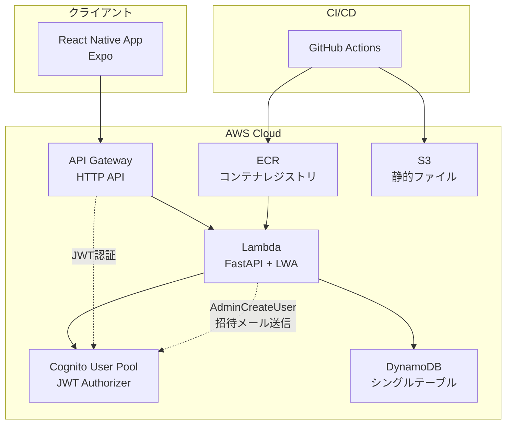
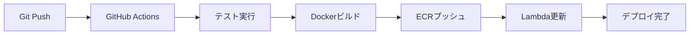

# システムアーキテクチャ

## 概要

Janlogは、AWS上で動作するサーバーレスアーキテクチャを採用したモバイルアプリケーションです。コスト効率と運用負荷の最小化を重視し、個人〜少人数利用に最適化された設計となっています。

## システム構成図



## 技術スタック

### フロントエンド
- **フレームワーク**: React Native (Expo SDK 51)
- **言語**: TypeScript
- **状態管理**: React Hooks + Context API
- **ナビゲーション**: React Navigation（タブナビゲーション）
- **認証**: AWS Amplify / Cognito SDK
- **プラットフォーム**: Android / iOS / Web（PWA）

### バックエンド
- **フレームワーク**: FastAPI (Python 3.11)
- **ランタイム**: AWS Lambda + Lambda Web Adapter (LWA)
- **デプロイ方式**: コンテナイメージベース（ECR + Lambda）
- **API Gateway**: HTTP API（プロキシ統合、JWT Authorizer）
- **認証**: AWS Cognito User Pool

### データストア
- **プライマリDB**: Amazon DynamoDB（オンデマンド課金）
- **設計**: シングルテーブル設計
- **GSI**: 期間検索用インデックス（MATCH_BY_USER_DATE）

### インフラ
- **IaC**: AWS CDK (TypeScript)
- **CI/CD**: GitHub Actions
- **コンテナレジストリ**: Amazon ECR
- **静的ファイル**: Amazon S3

## アーキテクチャ決定記録（ADR）

プロジェクトの主要な技術選定とアーキテクチャ決定は、以下のADRで文書化されています：

### ADR-0001: FastAPI on Lambda Web Adapter

**決定**: バックエンドはFastAPI（ASGI）をLambda Web Adapter (LWA)で実行

**理由**:
- 個人～少人数利用のMVP、月額コスト数百〜千円台に抑制
- ローカル開発はFastAPI + uvicornの快適さを活用
- 将来App Runner/ECSへ移行可能な柔軟性

**トレードオフ**: コールドスタート発生（数百ms〜）

### ADR-0002: DynamoDB シングルテーブル設計

**決定**: DynamoDB（オンデマンド課金）でシングルテーブル設計

**エンティティ構成**:
- `USER#{userId}/MATCH#{matchId}` - 対局データ
- `USER#{userId}/RULESET#{rulesetId}` - ルールセット
- `USER#{userId}/VENUE#{venueId}` - 会場データ
- `USER#{userId}/PROFILE` - ユーザープロフィール

**GSI**:
- GSI1: MATCH_BY_USER_DATE（期間取得）
- GSI2: MATCH_BY_USER_MODE_DATE（3麻/4麻高速フィルタ）

**理由**: 少人数・低トラでコスト最小化、運用負荷軽減

### ADR-0003: 認証にAmazon Cognito

**決定**: Cognito User Poolでメール+パスワード認証

**招待フロー**:
- 管理者がAdminCreateUser APIでユーザー作成
- Cognitoが自動で一時パスワード付き招待メール送信
- ユーザーは初回ログイン時に新パスワード設定

**理由**: 少人数招待配布、API Gateway JWT認可との相性

### ADR-0004: モノレポ構成と/spec仕様集約

**決定**: モノレポ構成、仕様関連は`/spec/`に集約

**構成**:
- `/spec/openapi.yaml` - APIの単一ソース
- `/spec/context.md` - 全体要約
- `/spec/adr/` - アーキテクチャ決定記録

**理由**: フロント/バック/インフラ横断での仕様共有、Kiroツール対応

### ADR-0005: 環境分離戦略

**決定**: local/development/production の3環境分離

**環境構成**:
- **local**: 静的JWT認証、DynamoDB Local（開発効率重視）
- **development**: Cognito認証、AWS DynamoDB（MVP公開用）
- **production**: Cognito認証、AWS DynamoDB（将来実装）

**認証方式**:
- local: 静的JWT注入（`mock-issuer`, `janlog-local`）
- development/production: Cognito User Pool JWT認証

**リソース命名**: `janlog-{resource}-{environment}`（略称なし）

**理由**: 本番データ汚染防止、開発効率と本番互換性の両立、MVP戦略対応

## データモデル概要

### DynamoDBシングルテーブル

```
テーブル名: janlog-table-{environment}

PK (Partition Key): USER#{userId} | GLOBAL
SK (Sort Key): MATCH#{matchId} | RULESET#{rulesetId} | VENUE#{venueId} | PROFILE

主要エンティティ:
- MATCH: 対局データ（日時、モード、順位、ポイント等）
- RULESET: ルールセット（ウマ、オカ設定）
- VENUE: 会場データ
- PROFILE: ユーザープロフィール
```

### アクセスパターン

1. **ユーザーの全対局取得**: PK=USER#{userId}, SK begins_with MATCH#
2. **期間指定対局取得**: GSI1（MATCH_BY_USER_DATE）使用
3. **ルールセット一覧**: PK=USER#{userId} OR GLOBAL, SK begins_with RULESET#
4. **会場一覧**: PK=USER#{userId}, SK begins_with VENUE#

## API設計方針

### RESTful API

- **ベースURL**: `/api/v1/`
- **認証**: JWT Bearer Token（Cognito発行）
- **レスポンス形式**: JSON
- **エラーハンドリング**: 統一されたエラーレスポンス形式

### 主要エンドポイント

```
認証:
- POST /auth/invite - Cognito招待（管理者のみ）
- GET /me - ユーザー情報取得

対局管理:
- GET /matches - 対局一覧取得
- POST /matches - 対局登録
- PUT /matches/{matchId} - 対局更新
- DELETE /matches/{matchId} - 対局削除

統計:
- GET /stats/summary - 成績サマリ取得

ルール管理:
- GET /rulesets - ルールセット一覧取得
- POST /rulesets - ルールセット作成
- PUT /rulesets/{rulesetId} - ルールセット更新
- DELETE /rulesets/{rulesetId} - ルールセット削除
- POST /rulesets/calculate - ポイント計算（プレビュー用）
```

詳細は `/spec/openapi.yaml` を参照してください。

## セキュリティアーキテクチャ

### 認証フロー

1. **招待制ユーザー登録**
   - 管理者がCognito AdminCreateUser APIでユーザー作成
   - Cognitoが一時パスワード付き招待メール送信
   - ユーザーが初回ログイン時にパスワード設定

2. **JWT認証**
   - Cognito User PoolがJWTトークン発行
   - API GatewayのJWT Authorizerで検証
   - Lambdaは検証済みユーザー情報を受け取る

### 認可

- **ユーザー**: 自分のデータのみアクセス可能
- **管理者**: グローバルルール作成、ユーザー招待が可能
- **権限チェック**: Lambda関数内でrole属性を確認

### データ保護

- **通信**: HTTPS強制
- **保存**: DynamoDB暗号化（AWS管理キー）
- **認証情報**: Secure Storageに保存

## スケーラビリティ

### 現在の設計（MVP）

- **想定ユーザー数**: 数人〜十数人
- **想定トラフィック**: 低頻度（1日数回〜数十回）
- **コスト制約**: 月額1,500円以内

### スケーリング戦略

1. **DynamoDB**: オンデマンド課金で自動スケール
2. **Lambda**: 同時実行数の自動スケール
3. **API Gateway**: 自動スケール

### 将来の拡張

- **ユーザー数増加**: Cognito User Poolは数百万ユーザーまで対応可能
- **トラフィック増加**: Lambda + DynamoDBで十分対応可能
- **コスト最適化**: プロビジョニング済みキャパシティへの移行検討

## 可用性・信頼性

### 現在の設計

- **SLA**: AWSマネージドサービスのSLAに依存
  - Lambda: 99.95%
  - DynamoDB: 99.99%
  - API Gateway: 99.95%
  - Cognito: 99.9%

### バックアップ戦略

- **DynamoDB**: ポイントインタイムリカバリ（PITR）有効化
- **データエクスポート**: 定期的なS3エクスポート（将来実装）

### 監視・ロギング

- **CloudWatch Logs**: Lambda実行ログ
- **CloudWatch Metrics**: API Gateway、Lambda、DynamoDBメトリクス
- **アラート**: エラー率、レイテンシの閾値監視（将来実装）

## パフォーマンス

### レイテンシ目標

- **API応答時間**: 500ms以内（P95）
- **画面遷移**: 1秒以内
- **対局登録**: 2秒以内

### 最適化戦略

1. **DynamoDB**:
   - シングルテーブル設計で結合不要
   - GSIで効率的なクエリ

2. **Lambda**:
   - コンテナイメージの最適化
   - メモリ設定の調整

3. **フロントエンド**:
   - ルールデータのクライアントキャッシュ
   - 不要な再レンダリング防止

## コスト構造

### 月額コスト見積もり（MVP）

```
想定: ユーザー5人、1人あたり月30対局

DynamoDB:
- 書き込み: 150回/月 × $1.25/100万 ≈ $0.00
- 読み込み: 600回/月 × $0.25/100万 ≈ $0.00
- ストレージ: 1GB未満 × $0.25/GB ≈ $0.25

Lambda:
- リクエスト: 1,000回/月 × $0.20/100万 ≈ $0.00
- 実行時間: 1,000回 × 500ms × 512MB ≈ $0.01

API Gateway:
- リクエスト: 1,000回/月 × $1.00/100万 ≈ $0.00

Cognito:
- MAU: 5人 × $0.0055/MAU ≈ $0.03

合計: 約$0.30/月（約45円/月）
```

### コスト最適化

- オンデマンド課金で使用量に応じた課金
- 無料枠の活用
- 不要なリソースの削除

## デプロイメント戦略

### CI/CD パイプライン



### デプロイフロー

1. **コード変更**: GitHubにプッシュ
2. **自動テスト**: GitHub Actionsでテスト実行
3. **コンテナビルド**: Dockerイメージビルド
4. **ECRプッシュ**: コンテナレジストリに登録
5. **Lambda更新**: 新しいイメージでLambda関数更新

### 環境別デプロイ

- **local**: ローカル開発環境（DynamoDB Local）
- **development**: MVP公開環境（AWS）
- **production**: 本番環境（将来実装）

## 運用・保守

### 開発コマンド体系

プロジェクトの開発コマンドは`Makefile`で統一管理されています。

```bash
# 開発環境起動
make start              # 個別ターミナル起動ガイド
make start-db           # DynamoDB Local起動
make start-backend      # バックエンドサーバー起動
make start-frontend     # フロントエンド起動

# テスト実行
make test               # 全コンポーネントテスト
make test-frontend      # フロントエンドテストのみ
make test-backend       # バックエンドテストのみ

# データベース管理
make db-init            # データベース統合初期化
make db-seed            # seedデータ投入

# デプロイ
make deploy-backend     # バックエンドデプロイ
make web-deploy         # Web版デプロイ
```

詳細は `/Makefile` および `/scripts/` を参照してください。

### モニタリング

- **CloudWatch Logs**: アプリケーションログ
- **CloudWatch Metrics**: パフォーマンスメトリクス
- **X-Ray**: 分散トレーシング（将来実装）

### トラブルシューティング

- **ログ確認**: CloudWatch Logsで詳細ログ確認
- **メトリクス確認**: CloudWatch Metricsでパフォーマンス確認
- **ロールバック**: 前バージョンのLambdaイメージに切り替え

## 将来の拡張計画

### Phase 2: 機能拡張

- 画像からポイント表を取り込み（Textract）
- セット麻雀の共有機能（ルーム/メンバー管理）
- 外部認証（Google/Apple）
- Web版（PWA）の本格対応

### Phase 3: スケール対応

- プロビジョニング済みキャパシティへの移行
- CloudFront + S3での静的コンテンツ配信
- マルチリージョン対応

### Phase 4: 高度な機能

- リアルタイム通知（WebSocket）
- 詳細な統計グラフ表示
- データ分析・レポート機能

## 関連ドキュメント

- **要件書**: `.kiro/specs/core/requirements.md`
- **設計書**: `.kiro/specs/core/design.md`
- **OpenAPI仕様**: `/spec/openapi.yaml`
- **ADR**: `/spec/adr/`
- **環境分離戦略**: `/spec/adr/ADR-0005-environment-strategy.md`
- **環境マトリクス**: `/spec/env-matrix.md`
- **README**: `/README.md`
