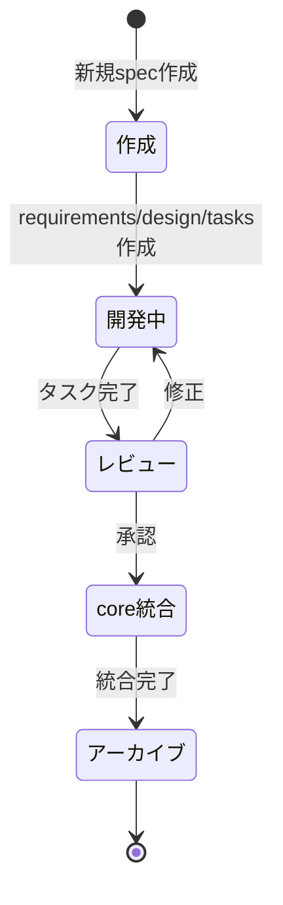

# 設計書

## 概要

Kiroのspec管理体系を、カテゴリ別ディレクトリ構造と統合仕様管理により整理する。`core/`ディレクトリで「正」の仕様を一元管理し、`features/`、`improvements/`、`bugfix/`で作業を分類し、完了後は`archive/`で保管する。steering機能により、Kiroが自動的に最新の統合仕様を参照できる環境を構築する。

## アーキテクチャ

### ディレクトリ構造

```
.kiro/
├── specs/
│   ├── README.md                          # spec管理体系の全体説明
│   ├── core/                              # 統合仕様（マスター）
│   │   ├── README.md                      # core/の役割と更新方針
│   │   ├── requirements.md                # 全体要件の統合版
│   │   ├── design.md                      # 全体設計の統合版
│   │   └── architecture.md                # システム全体のアーキテクチャ
│   ├── features/                          # 新機能追加spec（開発中）
│   │   ├── README.md                      # features/の使い方
│   │   ├── venue-management/              # 例: 会場管理機能
│   │   ├── image-ocr/                     # 例: 画像OCR機能
│   │   └── shared-room/                   # 例: 共有ルーム機能
│   ├── improvements/                      # 開発改善spec（開発中）
│   │   ├── README.md                      # improvements/の使い方
│   │   ├── ci-cd-deployment-strategy/     # 開発中: CI/CDデプロイ戦略
│   │   ├── commit-message-convention/     # 開発中: コミットメッセージ規約
│   │   └── version-management/            # 開発中: バージョン管理
│   ├── bugfix/                            # バグ修正spec（開発中）
│   │   └── README.md                      # bugfix/の使い方
│   └── archive/                           # 完了したspec
│       ├── README.md                      # archive/の参照方法
│       ├── features/                      # 完了した新機能spec
│       │   └── mahjong-score-management/  # 初期MVP
│       ├── improvements/                  # 完了した開発改善spec
│       │   ├── makefile-improvements/     # 完了: Makefile改善
│       │   ├── backend-test-data-management/ # 完了: テストデータ管理
│       │   └── spec-management/           # 完了: 本spec（完了後に移動）
│       └── bugfix/                        # 完了したバグ修正spec
│           └── react-native-buffer-polyfill/ # 完了: Buffer polyfill修正
└── steering/
    └── spec-management.md                 # spec運用ルール（自動参照設定）
```

### 設計原則

1. **Single Source of Truth**: `core/`が常に最新の統合仕様
2. **作業の分離**: 機能追加・改善・修正を独立したspecで開発
3. **履歴の保持**: 完了したspecは`archive/`で参照可能
4. **自動参照**: steering設定でKiroが`core/`を自動参照
5. **段階的統合**: 機能完了後に手動で`core/`にマージ

## コンポーネントとインターフェース

### 1. core/（統合仕様）

#### core/requirements.md
- **役割**: 全体要件の統合版
- **初期内容**: `mahjong-score-management/requirements.md`をベース
- **更新タイミング**: 新機能完了時に該当セクションを追加
- **参照方法**: `#[[file:.kiro/specs/core/requirements.md]]`

#### core/design.md
- **役割**: 全体設計の統合版
- **初期内容**: `mahjong-score-management/design.md`をベース
- **更新タイミング**: 新機能完了時に該当セクションを追加
- **参照方法**: `#[[file:.kiro/specs/core/design.md]]`

#### core/architecture.md
- **役割**: システム全体のアーキテクチャ概要
- **内容**:
  - システム構成図
  - 技術スタック
  - ADR参照リンク
  - データモデル概要
  - API設計方針
- **更新タイミング**: アーキテクチャ変更時
- **参照方法**: `#[[file:.kiro/specs/core/architecture.md]]`

#### core/README.md
- **役割**: core/の使い方ガイド
- **内容**:
  - core/の目的
  - 更新方針（機能完了後の統合手順）
  - 参照方法
  - 注意事項

### 2. features/（新機能追加spec）

#### ディレクトリ構成
```
features/
├── README.md
└── {feature-name}/
    ├── requirements.md
    ├── design.md
    └── tasks.md
```

#### 運用フロー
1. **作成**: 新機能追加時に`features/{feature-name}/`を作成
2. **開発**: requirements → design → tasks の順で作成・実行
3. **完了**: タスク完了後、`core/`に該当セクションを統合
4. **アーカイブ**: `archive/{feature-name}/`に移動

#### features/README.md
- **内容**:
  - 新機能spec作成方法
  - 命名規則（kebab-case）
  - core統合フロー
  - Kiroへの指示例

### 3. improvements/（開発改善spec）

#### ディレクトリ構成
```
improvements/
├── README.md
├── makefile-improvements/
├── backend-test-data-management/
└── spec-management/  # 本spec
```

#### 対象作業
- 開発環境改善
- ツール・スクリプト追加
- テスト基盤整備
- ドキュメント整備

#### improvements/README.md
- **内容**:
  - 開発改善specの作成方法
  - core統合の要否判断基準
  - 完了後の処理

### 4. bugfix/（バグ修正spec）

#### ディレクトリ構成
```
bugfix/
├── README.md
└── react-native-buffer-polyfill/
```

#### 対象作業
- バグ修正
- 緊急対応
- セキュリティパッチ

#### bugfix/README.md
- **内容**:
  - バグ修正specの作成方法
  - 緊急度の判断基準
  - core更新の要否

### 5. archive/（完了したspec）

#### ディレクトリ構成
```
archive/
├── README.md                      # archive全体の説明
├── features/                      # 完了した新機能spec
│   └── mahjong-score-management/  # 初期MVP
├── improvements/                  # 完了した開発改善spec
│   ├── makefile-improvements/
│   ├── backend-test-data-management/
│   └── spec-management/           # 本spec（完了後に移動）
└── bugfix/                        # 完了したバグ修正spec
    └── react-native-buffer-polyfill/
```

#### 設計原則
- **カテゴリ別分類**: 元のカテゴリ（features/improvements/bugfix）を維持
- **検索性の向上**: 目的別に整理されているため効率的に参照可能
- **履歴の保持**: git mvで移動し、Git履歴を保持

#### 完了判定基準

**features/の場合:**
1. tasks.mdの全タスクが完了（[x]マーク）
2. core/requirements.mdとcore/design.mdに統合済み
3. 統合内容のレビュー完了

**improvements/の場合:**
1. tasks.mdの全タスクが完了（[x]マーク）
2. core統合が必要な場合は統合済み
3. 関連ドキュメント（README.md、steering等）の更新完了

**bugfix/の場合:**
1. tasks.mdの全タスクが完了（[x]マーク）
2. 必要に応じてcore/の該当箇所を更新済み
3. 修正内容のテスト完了

#### archive移動手順

```bash
# 1. 完了確認
# - tasks.mdの全タスクが[x]になっているか確認
# - core統合が必要な場合は完了しているか確認

# 2. Git履歴を保持して移動
git mv .kiro/specs/features/{spec-name} .kiro/specs/archive/features/
git mv .kiro/specs/improvements/{spec-name} .kiro/specs/archive/improvements/
git mv .kiro/specs/bugfix/{spec-name} .kiro/specs/archive/bugfix/

# 3. コミット
git commit -m "archive: {spec-name}を完了としてarchiveに移動"
```

#### archive/README.md
- **内容**:
  - archiveの目的と階層構造の説明
  - カテゴリ別の完了spec一覧
  - 参照方法とKiroへの指示例
  - 検索のヒント（カテゴリ、機能名、日付等）
  - archive移動の判定基準と手順

### 6. steering/spec-management.md

#### 役割
- spec運用ルールの明文化
- Kiroへの自動参照設定

#### 内容構成

```markdown
# Spec管理運用ルール

## ディレクトリ構造
[構造図]

## 運用フロー

### 新機能追加
1. features/{feature-name}/を作成
2. requirements.md作成
3. design.md作成
4. tasks.md作成・実行
5. core/に統合
6. archive/に移動

### 開発改善
1. improvements/{improvement-name}/を作成
2. [同様のフロー]

### バグ修正
1. bugfix/{bug-name}/を作成
2. [同様のフロー]

## Kiroへの指示方法

### 統合仕様を参照した実装
「#[[file:.kiro/specs/core/requirements.md]]を参照して実装」

### 個別specのタスク実行
「features/venue-managementのタスク3を実行」

## 自動参照設定
このファイルがsteeringとして読み込まれることで、
Kiroは自動的にcore/配下の仕様を参照します。

#[[file:../specs/core/requirements.md]]
#[[file:../specs/core/design.md]]
#[[file:../specs/core/architecture.md]]
```

## データモデル

### spec管理のライフサイクル



### specカテゴリの判断基準

| カテゴリ | 対象 | core統合 | 例 |
|---------|------|---------|-----|
| features | 新機能追加 | 必須 | 会場管理、画像OCR |
| improvements | 開発環境改善 | 任意 | Makefile改善、テストデータ管理 |
| bugfix | バグ修正 | 必要に応じて | Buffer polyfill |

## エラーハンドリング

### ディレクトリ移動時の注意点

1. **相対パス参照の確認**
   - spec内で他のファイルを参照している場合、パスを更新
   - 特に`#[[file:...]]`形式の参照に注意

2. **Kiro履歴の考慮**
   - 移動前のパスでKiroが参照している可能性
   - 移動後は新しいパスで指示

3. **Git履歴の保持**
   - `git mv`コマンドで移動し、履歴を保持

### core統合時の競合解決

1. **セクション追加の原則**
   - 既存セクションは変更せず、新規セクションを追加
   - 既存機能への影響を最小化

2. **設計変更が必要な場合**
   - 別途design変更のspecを作成
   - 影響範囲を明確化

## テスト戦略

### 検証項目

1. **ディレクトリ構造の確認**
   - 全カテゴリディレクトリが作成されている
   - 各ディレクトリにREADME.mdが存在

2. **既存specの再配置確認**
   - 全specが適切なカテゴリに配置されている
   - spec内容が変更されていない

3. **core/の初期化確認**
   - requirements.md、design.md、architecture.mdが作成されている
   - mahjong-score-managementの内容が適切に反映されている

4. **steering設定の確認**
   - spec-management.mdが作成されている
   - 自動参照設定が機能している

5. **Kiroでの動作確認**
   - core/配下のファイルを参照した指示が機能する
   - 個別specのタスク実行が機能する

## パフォーマンス最適化

### ファイルサイズの管理

- **core/の肥大化防止**: 詳細は個別specに記載し、core/は概要のみ
- **archive/の整理**: 古いspecは定期的に圧縮または削除を検討

### 参照の効率化

- **steering設定の最適化**: 必要最小限のファイルのみ自動参照
- **README.mdの活用**: 各カテゴリの概要をREADMEに集約

## セキュリティ考慮事項

### 機密情報の管理

- **spec内に機密情報を含めない**: 環境変数、APIキー等は別管理
- **archive/の公開範囲**: 必要に応じてarchive/を.gitignoreに追加

## 将来の拡張計画

### Phase 2: 自動化ツール

- **spec統合スクリプト**: features/からcore/への自動マージツール
- **spec検証ツール**: 必須セクションの存在確認

### Phase 3: テンプレート化

- **specテンプレート**: 各カテゴリ用のrequirements/design/tasksテンプレート
- **Kiroコマンド**: 「新しいfeature specを作成」で自動生成

### Phase 4: メトリクス

- **spec完了率**: 各specの進捗可視化
- **core更新履歴**: 統合仕様の変更履歴追跡
