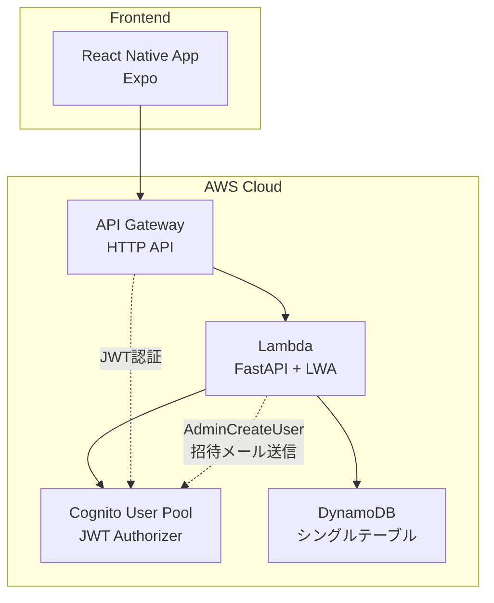

# 設計書

## 概要

Janlogは、個人の麻雀成績を記録・管理するモバイルアプリです。React Native（Expo）でフロントエンドを構築し、FastAPI on Lambda（LWA）でバックエンドを実装します。認証にはAWS Cognito、データストレージにはDynamoDBを使用し、招待制による限定的なユーザー管理を行います。

## アーキテクチャ

### システム構成

ADR-0001、ADR-0003に基づく構成：



### 技術スタック

- **フロントエンド**: React Native (Expo)
- **バックエンド**: FastAPI on Lambda Web Adapter (LWA)
- **API Gateway**: HTTP API（プロキシ統合）
- **認証**: AWS Cognito User Pool + JWT Authorizer
- **データベース**: DynamoDB（オンデマンド課金、シングルテーブル設計）
- **招待メール**: Cognito User Pool（AdminCreateUser API）
- **CI/CD**: GitHub Actions
- **インフラ**: AWS CDK/CloudFormation
- **リポジトリ**: モノレポ構成（ADR-0004）

## コンポーネントとインターフェース

### フロントエンドコンポーネント

#### 画面構成

1. **認証画面**
   - ログイン画面
   - アカウント作成画面（招待リンク経由）

2. **メイン画面（タブナビゲーション）**
   - 統計画面（トップ画面）
   - 履歴画面
   - 対局登録画面

3. **管理画面（管理者のみ）**
   - ルール管理画面

#### コンポーネント設計

```
src/
├── components/
│   ├── auth/
│   │   ├── LoginScreen.tsx
│   │   └── SignUpScreen.tsx
│   ├── stats/
│   │   ├── StatsScreen.tsx
│   │   ├── StatsCard.tsx
│   │   └── GameModeTab.tsx
│   ├── history/
│   │   ├── HistoryScreen.tsx
│   │   ├── MatchList.tsx
│   │   └── MatchDetail.tsx
│   ├── match/
│   │   ├── MatchRegistrationScreen.tsx
│   │   ├── EntryMethodSelector.tsx
│   │   └── RuleSelector.tsx
│   ├── admin/
│   │   ├── RuleManagementScreen.tsx
│   │   └── RuleForm.tsx
│   └── common/
│       ├── DatePicker.tsx
│       ├── LoadingSpinner.tsx
│       └── ErrorMessage.tsx
├── services/
│   ├── api.ts
│   ├── auth.ts
│   └── storage.ts
├── types/
│   ├── match.ts
│   ├── stats.ts
│   ├── rule.ts
│   └── user.ts
└── utils/
    ├── calculations.ts
    └── validation.ts
```

### バックエンドAPI設計

#### エンドポイント構成

```
/api/v1/
├── auth/
│   ├── POST /invite          # Cognito招待（管理者のみ）
│   └── GET  /me              # ユーザー情報取得
├── matches/
│   ├── GET    /              # 対局一覧取得
│   ├── POST   /              # 対局登録
│   ├── PUT    /{matchId}     # 対局更新
│   └── DELETE /{matchId}     # 対局削除
├── stats/
│   └── GET /summary          # 成績サマリ取得
└── rulesets/
    ├── GET    /              # ルールセット一覧取得
    ├── POST   /              # ルールセット作成（管理者のみ）
    ├── PUT    /{rulesetId}   # ルールセット更新（管理者のみ）
    └── DELETE /{rulesetId}   # ルールセット削除（管理者のみ）
```

#### サービス層設計

```
backend/
├── app/
│   ├── main.py               # FastAPI + LWA アプリケーション
│   ├── models/
│   │   ├── match.py
│   │   ├── ruleset.py
│   │   ├── user.py
│   │   └── stats.py
│   ├── services/
│   │   ├── auth_service.py
│   │   ├── match_service.py
│   │   ├── ruleset_service.py
│   │   ├── stats_service.py
│   │   └── cognito_service.py
│   ├── repositories/
│   │   └── dynamodb_repository.py  # シングルテーブル用リポジトリ
│   ├── utils/
│   │   ├── calculations.py
│   │   ├── validators.py
│   │   ├── decorators.py
│   │   └── dynamodb_utils.py
│   └── config/
│       └── settings.py
├── requirements.txt
└── lambda_function.py        # LWA エントリーポイント
```

## データモデル

### DynamoDBシングルテーブル設計

ADR-0002に基づき、シングルテーブル設計を採用します。

#### メインテーブル（janlog-table）

```
PK (Partition Key) | SK (Sort Key) | エンティティタイプ
-------------------|---------------|------------------
USER#{userId}      | MATCH#{matchId} | 対局データ
USER#{userId}      | RULESET#{rulesetId} | ルールセット
USER#{userId}      | VENUE#{venueId} | 会場データ
USER#{userId}      | PROFILE | ユーザープロフィール
```

#### 対局データ（MATCH）

```
PK: USER#{userId}
SK: MATCH#{matchId}
Attributes:
- entityType: "MATCH"
- date (ISO datetime)
- gameMode (three | four)
- entryMethod (rank_plus_points | rank_plus_raw | provisional_rank_only)
- rulesetId (ルールセットID)
- rank (1-4)
- finalPoints (number, nullable)
- rawScore (integer, nullable)
- chipCount (integer, nullable)
- venueId (string, nullable)
- memo (string, nullable)
- createdAt (ISO datetime)
- updatedAt (ISO datetime)
```

#### ルールセットデータ（RULESET）

```
PK: USER#{userId}
SK: RULESET#{rulesetId}
Attributes:
- entityType: "RULESET"
- ruleName (string)
- gameMode (three | four)
- uma (object)
  - first: number
  - second: number
  - third: number
  - fourth: number (4人麻雀のみ)
- oka (number)
- isDefault (boolean)
- createdAt (ISO datetime)
- updatedAt (ISO datetime)
```

#### ユーザープロフィール（PROFILE）

```
PK: USER#{userId}
SK: PROFILE
Attributes:
- entityType: "PROFILE"
- email (string)
- displayName (string)
- role (user | admin)
- invitedBy (userId, nullable)
- createdAt (ISO datetime)
- lastLoginAt (ISO datetime)
```

#### GSI設計

**GSI1: MATCH_BY_USER_DATE**
```
PK: USER#{userId}#MATCH
SK: date
- 期間指定での対局取得に使用
```

**GSI2: MATCH_BY_USER_MODE_DATE（将来拡張）**
```
PK: USER#{userId}#MATCH#{gameMode}
SK: date
- 3人麻雀・4人麻雀の高速フィルタリングに使用
```

### TypeScript型定義

```typescript
// DynamoDBエンティティ基底型
interface BaseEntity {
  PK: string;
  SK: string;
  entityType: string;
  createdAt: string;
  updatedAt: string;
}

// Match型
interface Match extends BaseEntity {
  entityType: 'MATCH';
  PK: `USER#${string}`;
  SK: `MATCH#${string}`;
  matchId: string;
  date: string;
  gameMode: 'three' | 'four';
  entryMethod: 'rank_plus_points' | 'rank_plus_raw' | 'provisional_rank_only';
  rulesetId: string;
  rank: number;
  finalPoints?: number;
  rawScore?: number;
  chipCount?: number;
  venueId?: string;
  memo?: string;
}

// Ruleset型
interface Ruleset extends BaseEntity {
  entityType: 'RULESET';
  PK: `USER#${string}`;
  SK: `RULESET#${string}`;
  rulesetId: string;
  ruleName: string;
  gameMode: 'three' | 'four';
  uma: {
    first: number;
    second: number;
    third: number;
    fourth?: number;
  };
  oka: number;
  isDefault: boolean;
}

// UserProfile型
interface UserProfile extends BaseEntity {
  entityType: 'PROFILE';
  PK: `USER#${string}`;
  SK: 'PROFILE';
  userId: string;
  email: string;
  displayName: string;
  role: 'user' | 'admin';
  invitedBy?: string;
  lastLoginAt?: string;
}

// StatsSummary型（既存OpenAPIに準拠）
interface StatsSummary {
  count: number;
  avgRank: number;
  topRate: number;
  lastRate: number;
  totalPoints: number;
  chipTotal: number;
}
```

## エラーハンドリング

### エラー分類

1. **認証エラー**
   - 401 Unauthorized: トークン無効・期限切れ
   - 403 Forbidden: 権限不足（管理者機能アクセス）

2. **バリデーションエラー**
   - 400 Bad Request: 入力データ不正
   - 422 Unprocessable Entity: ビジネスルール違反

3. **リソースエラー**
   - 404 Not Found: リソース未存在
   - 409 Conflict: データ競合

4. **システムエラー**
   - 500 Internal Server Error: サーバー内部エラー
   - 503 Service Unavailable: 外部サービス利用不可

### エラーレスポンス形式

```typescript
interface ErrorResponse {
  error: {
    code: string;
    message: string;
    details?: any;
  };
  timestamp: string;
  path: string;
}
```

## テスト戦略

### フロントエンドテスト

1. **単体テスト**
   - Jest + React Native Testing Library
   - コンポーネントのレンダリング・イベント処理
   - ユーティリティ関数のロジック

2. **統合テスト**
   - API通信のモック
   - 画面遷移フロー

### バックエンドテスト

1. **単体テスト**
   - pytest
   - サービス層・リポジトリ層のロジック
   - ポイント計算ロジック

2. **統合テスト**
   - FastAPI TestClient
   - エンドポイントの動作確認
   - DynamoDB Local使用

3. **E2Eテスト**
   - 認証フローの確認
   - 対局登録〜統計表示の一連の流れ

### テストデータ管理

- DynamoDB Local使用
- テスト用ルールデータの準備
- モックユーザーデータの作成

## セキュリティ考慮事項

### 認証・認可

1. **Cognito招待フロー**
   - 管理者がCognito AdminCreateUser APIでユーザーを作成
   - Cognitoが自動で一時パスワード付き招待メールを送信
   - ユーザーは初回ログイン時に新しいパスワードを設定

2. **JWT トークン管理**
   - アクセストークンの適切な保存（Secure Storage）
   - リフレッシュトークンによる自動更新

3. **権限管理**
   - 管理者機能へのアクセス制御
   - ユーザー自身のデータのみアクセス可能

### データ保護

1. **入力検証**
   - フロントエンド・バックエンド両方での検証
   - SQLインジェクション対策（NoSQLだが同様の考慮）

2. **通信セキュリティ**
   - HTTPS通信の強制
   - CORS設定の適切な管理

### プライバシー

1. **データ最小化**
   - 必要最小限のデータのみ収集
   - 個人を特定できる情報の制限

2. **データ保持**
   - 不要になったデータの削除ポリシー
   - ユーザーによるデータ削除機能

## パフォーマンス最適化

### フロントエンド

1. **レンダリング最適化**
   - React.memo使用
   - 不要な再レンダリング防止

2. **データ取得最適化**
   - キャッシュ戦略
   - ページネーション実装

### バックエンド

1. **DynamoDB最適化**
   - 適切なパーティションキー設計
   - GSIの効果的な活用

2. **Lambda最適化**
   - コールドスタート対策
   - メモリ設定の最適化

### ネットワーク

1. **API最適化**
   - レスポンスサイズの最小化
   - 必要なデータのみ取得

2. **キャッシュ戦略**
   - ルールデータのクライアントサイドキャッシュ
   - 統計データの適切なキャッシュ期間設定