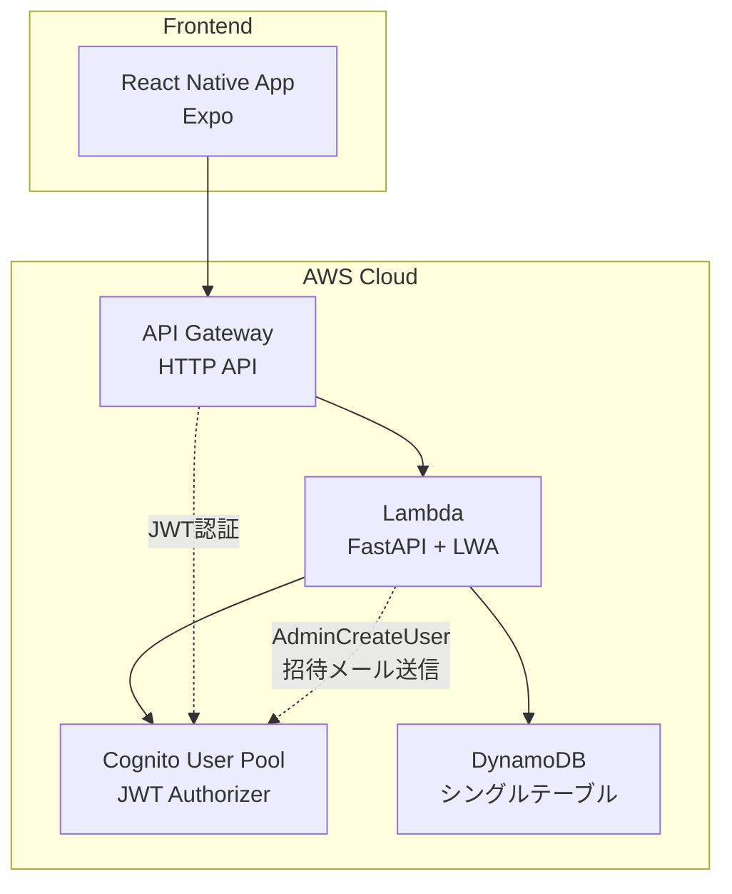

# 設計書

## 概要

Janlogは、個人の麻雀成績を記録・管理するモバイルアプリです。React Native（Expo）でフロントエンドを構築し、FastAPI on Lambda（LWA）でバックエンドを実装します。認証にはAWS Cognito、データストレージにはDynamoDBを使用し、招待制による限定的なユーザー管理を行います。

## アーキテクチャ

### システム構成

ADR-0001、ADR-0003に基づく構成：



### 技術スタック

- **フロントエンド**: React Native (Expo)
- **バックエンド**: FastAPI on Lambda Web Adapter (LWA)
- **API Gateway**: HTTP API（プロキシ統合）
- **認証**: AWS Cognito User Pool + JWT Authorizer
- **データベース**: DynamoDB（オンデマンド課金、シングルテーブル設計）
- **招待メール**: Cognito User Pool（AdminCreateUser API）
- **CI/CD**: GitHub Actions
- **インフラ**: AWS CDK/CloudFormation
- **リポジトリ**: モノレポ構成（ADR-0004）

## コンポーネントとインターフェース

### フロントエンドコンポーネント

#### 画面構成

1. **認証画面**
   - ログイン画面
   - アカウント作成画面（招待リンク経由）

2. **メイン画面（タブナビゲーション）**
   - 統計画面（トップ画面）
   - 履歴画面
   - 対局登録画面

3. **管理画面（管理者のみ）**
   - ルール管理画面

#### コンポーネント設計

```
src/
├── components/
│   ├── auth/
│   │   ├── LoginScreen.tsx
│   │   └── SignUpScreen.tsx
│   ├── stats/
│   │   ├── StatsScreen.tsx
│   │   ├── StatsCard.tsx
│   │   └── GameModeTab.tsx
│   ├── history/
│   │   ├── HistoryScreen.tsx
│   │   ├── MatchList.tsx
│   │   └── MatchDetail.tsx
│   ├── match/
│   │   ├── MatchRegistrationScreen.tsx
│   │   ├── EntryMethodSelector.tsx
│   │   ├── RuleSelector.tsx
│   │   └── PointCalculationDisplay.tsx
│   ├── admin/
│   │   ├── RuleManagementScreen.tsx
│   │   └── RuleForm.tsx
│   └── common/
│       ├── DatePicker.tsx
│       ├── LoadingSpinner.tsx
│       └── ErrorMessage.tsx
├── services/
│   ├── api.ts
│   ├── auth.ts
│   └── storage.ts
├── types/
│   ├── match.ts
│   ├── stats.ts
│   ├── rule.ts
│   └── user.ts
└── utils/
    ├── calculations.ts
    └── validation.ts
```

### バックエンドAPI設計

#### エンドポイント構成

```
/api/v1/
├── auth/
│   ├── POST /invite          # Cognito招待（管理者のみ）
│   └── GET  /me              # ユーザー情報取得
├── matches/
│   ├── GET    /              # 対局一覧取得
│   ├── POST   /              # 対局登録
│   ├── PUT    /{matchId}     # 対局更新
│   └── DELETE /{matchId}     # 対局削除
├── stats/
│   └── GET /summary          # 成績サマリ取得
└── rulesets/
    ├── GET    /              # ルールセット一覧取得（グローバル+個人）
    ├── POST   /              # ルールセット作成
    ├── PUT    /{rulesetId}   # ルールセット更新
    ├── DELETE /{rulesetId}   # ルールセット削除
    ├── POST /calculate       # ポイント計算（プレビュー用）
    ├── GET  /templates       # ルールテンプレート一覧取得
    └── GET  /rule-options    # ルール選択肢一覧取得（UI用）
```

#### ポイント計算ロジック

**基本計算式：**
```
最終ポイント = (素点 - 基準点) / 1000 + ウマ + オカ
```

**ウマとオカの概念：**
- **ウマ**: 順位間の点数差（整数、例：「10-30」= [+30, +10, -10, -30]）
- **オカ**: トップ者が総取りするボーナスポイント（整数、通常は (基準点-開始点)×人数）
- 最終ポイントは1000点単位で計算し、小数点第1位まで表示

**ウマ計算方式：**
- **useFloatingUma=false**: 固定ウマ配列を使用（Mリーグ、フリー雀荘など）
- **useFloatingUma=true**: 浮き人数（基準点以上の人数）によってウマが変動（日本プロ麻雀連盟）

**将来拡張（浮きウマルール）:**
- 浮き人数を計算: 基準点以上の素点を持つ人数をカウント
- useFloatingUma=trueの場合、umaMatrixから該当する浮き人数のウマ配列を取得
- useFloatingUma=falseの場合、標準のuma配列を使用

**ルール管理API拡張:**
- **GET /rulesets/templates**: よく使われるルールセットのテンプレート一覧
  - Mリーグルール、フリー雀荘標準ルール、競技麻雀ルールなど
- **GET /rulesets/rule-options**: UI用のルール選択肢一覧
  - 戦略ルール、進行ルール、追加ルールの選択肢とデフォルト値

**Mリーグルール（4人麻雀）の具体例：**
- ルール: 25000点持ち30000点返し、ウマ「10-30」（ワンスリー）、オカ+20
- オカ計算: (30000-25000)×4人 / 1000 = +20

**計算例1（4人麻雀）:**
1位: 素点45100点 → (45100-30000)/1000 + 30 + 20 = 15.1 + 30 + 20 = +65.1pt
2位: 素点32400点 → (32400-30000)/1000 + 10 + 0 = 2.4 + 10 + 0 = +12.4pt
3位: 素点14700点 → (14700-30000)/1000 + (-10) + 0 = -15.3 + (-10) + 0 = -25.3pt
4位: 素点7800点 → (7800-30000)/1000 + (-30) + 0 = -22.2 + (-30) + 0 = -52.2pt
※点数合計: 100000点、ポイント合計: 0pt

**計算例2（3人麻雀）:**
- ルール: 35000点持ち40000点返し、ウマ「20」、オカ+15
- オカ計算: (40000-35000)×3人 / 1000 = +15
- ウマ配列: [+20, 0, -20]

1位: 素点52300点 → (52300-40000)/1000 + 20 + 15 = 12.3 + 20 + 15 = +47.3pt
2位: 素点38900点 → (38900-40000)/1000 + 0 + 0 = -1.1 + 0 + 0 = -1.1pt
3位: 素点13800点 → (13800-40000)/1000 + (-20) + 0 = -26.2 + (-20) + 0 = -46.2pt
※点数合計: 105000点、ポイント合計: 0pt

**計算例3（仮スコア方式）:**
- ルール: Mリーグルール（25000点持ち30000点返し、ウマ「10-30」、オカ+20）
- 仮素点: 開始点25000 + 増減値を使用

1位: 仮素点40000点(25000+15000) → (40000-30000)/1000 + 30 + 20 = 10.0 + 30 + 20 = +60.0pt
2位: 仮素点30000点(25000+5000) → (30000-30000)/1000 + 10 + 0 = 0.0 + 10 + 0 = +10.0pt
3位: 仮素点20000点(25000-5000) → (20000-30000)/1000 + (-10) + 0 = -10.0 + (-10) + 0 = -20.0pt
4位: 仮素点10000点(25000-15000) → (10000-30000)/1000 + (-30) + 0 = -20.0 + (-30) + 0 = -50.0pt
※仮点数合計: 100000点、ポイント合計: 0pt

#### サービス層設計

```
backend/
├── app/
│   ├── main.py               # FastAPI + LWA アプリケーション
│   ├── models/
│   │   ├── match.py
│   │   ├── ruleset.py
│   │   ├── user.py
│   │   └── stats.py
│   ├── services/
│   │   ├── auth_service.py
│   │   ├── match_service.py
│   │   ├── ruleset_service.py
│   │   ├── stats_service.py
│   │   └── cognito_service.py
│   ├── repositories/
│   │   └── dynamodb_repository.py  # シングルテーブル用リポジトリ
│   ├── utils/
│   │   ├── calculations.py
│   │   ├── validators.py
│   │   ├── decorators.py
│   │   └── dynamodb_utils.py
│   └── config/
│       └── settings.py
├── requirements.txt
└── lambda_function.py        # LWA エントリーポイント
```

## データモデル

### DynamoDBシングルテーブル設計

ADR-0002に基づき、シングルテーブル設計を採用します。

#### メインテーブル（janlog-table）

```
| PK (Partition Key) | SK (Sort Key)       | エンティティタイプ   |
| ------------------ | ------------------- | -------------------- |
| USER#{userId}      | MATCH#{matchId}     | 対局データ           |
| USER#{userId}      | RULESET#{rulesetId} | ルールセット         |
| USER#{userId}      | VENUE#{venueId}     | 会場データ           |
| USER#{userId}      | PROFILE             | ユーザープロフィール |
```

#### 対局データ（MATCH）

```
PK: USER#{userId}
SK: MATCH#{matchId}
Attributes:
- entityType: "MATCH"
- date (ISO datetime)
- gameMode (three | four)
- entryMethod (rank_plus_points | rank_plus_raw | provisional_rank_only)
- rulesetId (ルールセットID)
- rank (1-4)
- finalPoints (number, nullable) # 小数点第1位まで（例：+50.0, +11.2）
- rawScore (integer, nullable)
- chipCount (integer, nullable)
- venueId (string, nullable)
- memo (string, nullable)
- createdAt (ISO datetime)
- updatedAt (ISO datetime)
```

#### 入力バリデーションルール

**順位（rank）:**
- 範囲: 1〜3（3人麻雀）、1〜4（4人麻雀）
- 必須項目

**素点（rawScore）:**
- 範囲: -999900〜999900
- 単位: 100点単位（下2桁は00固定）
- 例: 45000, -18000, 32100（有効）/ 4500, 123（無効）
- 入力方式が`rank_plus_raw`の場合に必須

**最終ポイント（finalPoints）:**
- 範囲: -999.9〜999.9
- 精度: 小数点第1位まで
- 例: +25.0, -15.5, 100.0（有効）/ 1000.0, -1500.5（無効）
- 入力方式が`rank_plus_points`の場合に必須

**入力方式（entryMethod）:**
- `rank_plus_points`: 順位+最終ポイント直接入力
- `rank_plus_raw`: 順位+素点入力（自動ポイント計算）
- `provisional_rank_only`: 順位のみ（仮スコア計算）

#### 仮スコア入力方式（provisional_rank_only）の詳細設計

**概要:**
順位のみを入力し、固定の仮素点を使用してポイント計算を行う方式。素点を忘れた場合や、大まかな成績記録に使用する。

**仮素点の計算方式:**
### 4人麻雀
- 1位: 開始点 + 15000点
- 2位: 開始点 + 5000点  
- 3位: 開始点 - 5000点
- 4位: 開始点 - 15000点
### 3人麻雀
- 1位: 開始点 + 15000点
- 2位: 開始点 + 0点
- 3位: 開始点 - 15000点

**設計原則:**
- ゲームモード（3人麻雀/4人麻雀）に応じた同じ増減値を使用
- - ルールセットの開始点に応じて適切な仮素点を計算
- バックエンドとフロントエンドで同じ計算ロジックを使用

**計算フロー:**
1. ユーザーが順位のみを入力
2. システムが選択されたルールセットの開始点を取得
3. 順位に対応する増減値を開始点に加算して仮素点を計算
4. 選択されたルールセット（ウマ・オカ）を使用してポイント計算
5. 計算結果を「仮ポイント」として表示
6. 仮計算であることを明示する警告メッセージを表示

**UI表示:**
- 入力方式選択: 「順位のみ」
- セクションタイトル: 「順位のみ入力」
- 説明文: 「順位のみで仮のスコアを計算します。開始点からの増減: 1位(+15000), 2位(+5000), 3位(-5000), 4位(-15000)」
  - 3人麻雀の場合は説明を合わせて変更
- 計算結果タイトル: 「計算結果（順位のみ）」
- 警告メッセージ: 「※ これは仮の計算結果です。実際の素点とは異なる場合があります。」

**バックエンド実装:**
- `PointCalculator.calculate_provisional_points()` メソッドで開始点からの増減値を使用
- 対局作成時に `_calculate_provisional_score()` で自動計算
- 計算結果に `isProvisional: true` フラグを設定

**フロントエンド実装:**
- `calculateProvisionalPointsAutomatically()` 関数で開始点からの増減
- 順位入力時の自動計算（300msデバウンス）
- 計算結果の詳細表示（仮素点、基本計算、ウマ、オカ）

**バリデーション:**
- 順位の範囲チェック（1-3位または1-4位）
- ルールセット選択必須
- 無効な順位では計算を実行しない

**エラーハンドリング:**
- 計算API呼び出し失敗時は結果を非表示
- ルールセット未選択時は計算を実行しない
- 入力方式変更時は計算結果をクリア

#### ルールセットデータ（RULESET）

```
PK: USER#{userId} | GLOBAL
SK: RULESET#{rulesetId}
Attributes:
- entityType: "RULESET"
- ruleName (string)
- gameMode (three | four)

# ポイント計算関連ルール
- startingPoints (number) # 開始点（例：25000）
- basePoints (number) # 基準点（例：30000）
- useFloatingUma (boolean) # 浮きウマを使用するかどうか（false=固定ウマ、true=浮き人数別ウマ）
- uma (array of numbers) # 標準ウマ配列（整数）3人:[+20, 0, -20] 4人:[+30, +10, -10, -30]
- umaMatrix (object, nullable) # 浮き人数別ウマ表（useFloatingUma=trueの場合に使用）
- oka (number) # オカポイント（整数、1位が総取り、通常+20 or +15）
- useChips (boolean) # チップを使用するかどうか（true=チップあり、false=チップなし、デフォルト: false）

# 基本ルール（卓につく前に確認する重要ルール）
- basicRules (object, nullable) # 戦略に影響する基本ルール（例：赤牌、喰いタンなど）

# 進行ルール（卓で進行中に気になる細かいルール）
- gameplayRules (object, nullable) # ゲーム進行の細かいルール（例：途中流局、ダブロンなど）

# 追加ルール（その他の細かい設定）
- additionalRules (array of objects, nullable) # 自由設定可能な追加ルール

**データ拡張の考慮事項：**
- 各ルールオブジェクトはnullable設計
- 既存データは各ルールフィールドがnullまたは空オブジェクト
- 将来の項目追加時は、既存データに影響なし（デフォルト値で補完）
- アプリケーション側でnullチェックとデフォルト値設定を実装

- memo (string, nullable) # 任意メモ（例：「○○店ルール」）
- isGlobal (boolean) # 管理者作成の全員共通ルール
- createdBy (userId) # 作成者ID
- createdAt (ISO datetime)
- updatedAt (ISO datetime)
```

**umaMatrix構造例（将来拡張用）:**
```json
{
  "0": [0, 0, 0, 0],      // 浮き0人
  "1": [12, -1, -3, -8],  // 浮き1人
  "2": [8, 4, -4, -8],    // 浮き2人
  "3": [8, 3, 1, -12],    // 浮き3人
  "4": [0, 0, 0, 0]       // 浮き4人
}
```

**ルール階層の考え方:**
1. **ポイント計算ルール**: 成績に直接影響（ウマ、オカ、基準点など）
2. **戦略ルール**: 打ち方に大きく影響（赤牌、喰いタン、後付けなど）
3. **進行ルール**: ゲーム進行の詳細（途中流局、ダブロンなど）
4. **追加ルール**: その他の自由設定項目

#### ユーザープロフィール（PROFILE）

```
PK: USER#{userId}
SK: PROFILE
Attributes:
- entityType: "PROFILE"
- email (string)
- displayName (string)
- role (user | admin)
- invitedBy (userId, nullable)
- createdAt (ISO datetime)
- lastLoginAt (ISO datetime)
```

#### GSI設計

**GSI1: MATCH_BY_USER_DATE**
```
PK: USER#{userId}#MATCH
SK: date
- 期間指定での対局取得に使用
```

**GSI2: MATCH_BY_USER_MODE_DATE（将来拡張）**
```
PK: USER#{userId}#MATCH#{gameMode}
SK: date
- 3人麻雀・4人麻雀の高速フィルタリングに使用
```

### TypeScript型定義

```typescript
// DynamoDBエンティティ基底型
interface BaseEntity {
  PK: string;
  SK: string;
  entityType: string;
  createdAt: string;
  updatedAt: string;
}

// Match型
interface Match extends BaseEntity {
  entityType: 'MATCH';
  PK: `USER#${string}`;
  SK: `MATCH#${string}`;
  matchId: string;
  date: string;
  gameMode: 'three' | 'four';
  entryMethod: 'rank_plus_points' | 'rank_plus_raw' | 'provisional_rank_only';
  rulesetId: string;
  rank: number;
  finalPoints?: number;
  rawScore?: number;
  chipCount?: number;
  venueId?: string;
  memo?: string;
}

// 基本ルール型（将来拡張用）
interface BasicRules {
  [key: string]: any; // 柔軟な拡張に対応（例：redTiles, openTanyao等）
}

// 進行ルール型（将来拡張用）
interface GameplayRules {
  [key: string]: any; // 柔軟な拡張に対応（例：abortiveDraw, doubleRon等）
}

// 追加ルール項目型
interface AdditionalRule {
  name: string; // ルール名
  value: string; // 設定値
  enabled: boolean; // 有効/無効
}

// Ruleset型
interface Ruleset extends BaseEntity {
  entityType: 'RULESET';
  PK: `USER#${string}` | 'GLOBAL';
  SK: `RULESET#${string}`;
  rulesetId: string;
  ruleName: string;
  gameMode: 'three' | 'four';
  
  // ポイント計算関連
  startingPoints: number; // 開始点（例：25000）
  basePoints: number; // 基準点（例：30000）
  useFloatingUma: boolean; // 浮きウマを使用するかどうか
  uma: number[]; // 標準ウマ配列（整数）3人:[+20, 0, -20] 4人:[+30, +10, -10, -30]
  umaMatrix?: Record<string, number[]>; // 浮き人数別ウマ表（useFloatingUma=trueの場合に使用）
  oka: number; // オカポイント（整数、1位が総取り、通常+20 or +15）
  useChips: boolean; // チップを使用するかどうか（true=チップあり、false=チップなし、デフォルト: false）
  
  // 階層化されたルール（将来拡張用）
  basicRules?: BasicRules; // 基本ルール（卓につく前に確認する重要ルール）
  gameplayRules?: GameplayRules; // 進行ルール（卓で進行中に気になる細かいルール）
  additionalRules?: AdditionalRule[]; // 追加ルール（その他の細かい設定）
  
  memo?: string; // 任意メモ
  isGlobal: boolean; // 管理者作成の全員共通ルール
  createdBy: string; // 作成者ID
}

// UserProfile型
interface UserProfile extends BaseEntity {
  entityType: 'PROFILE';
  PK: `USER#${string}`;
  SK: 'PROFILE';
  userId: string;
  email: string;
  displayName: string;
  role: 'user' | 'admin';
  invitedBy?: string;
  lastLoginAt?: string;
}

// StatsSummary型（既存OpenAPIに準拠）
interface StatsSummary {
  count: number;
  avgRank: number;
  topRate: number;
  lastRate: number;
  totalPoints: number;
  chipTotal?: number; // チップありルールでの対局がある場合のみ表示
}
```

## エラーハンドリング

### エラー分類

1. **認証エラー**
   - 401 Unauthorized: トークン無効・期限切れ
   - 403 Forbidden: 権限不足（管理者機能アクセス）

2. **バリデーションエラー**
   - 400 Bad Request: 入力データ不正
   - 422 Unprocessable Entity: ビジネスルール違反

**具体的なバリデーションエラー:**
- 順位エラー: 「1〜3位で入力してください」（3人麻雀の場合）
- 素点エラー: 「6桁までの数値を入力してください（下2桁は00）」
- 最終ポイントエラー: 「3桁までの数値を入力してください」
- 必須項目エラー: 「ルールを選択してください」
- 計算エラー: 「ポイントが計算されていません。順位と素点を正しく入力してください」

3. **リソースエラー**
   - 404 Not Found: リソース未存在
   - 409 Conflict: データ競合

4. **システムエラー**
   - 500 Internal Server Error: サーバー内部エラー
   - 503 Service Unavailable: 外部サービス利用不可

### エラーレスポンス形式

```typescript
interface ErrorResponse {
  error: {
    code: string;
    message: string;
    details?: any;
  };
  timestamp: string;
  path: string;
}
```

## テスト戦略

### フロントエンドテスト

1. **単体テスト**
   - Jest + React Native Testing Library
   - コンポーネントのレンダリング・イベント処理
   - ユーティリティ関数のロジック

2. **統合テスト**
   - API通信のモック
   - 画面遷移フロー

### バックエンドテスト

1. **単体テスト**
   - pytest
   - サービス層・リポジトリ層のロジック
   - ポイント計算ロジック

2. **統合テスト**
   - FastAPI TestClient
   - エンドポイントの動作確認
   - DynamoDB Local使用

3. **E2Eテスト**
   - 認証フローの確認
   - 対局登録〜統計表示の一連の流れ

### テストデータ管理

- DynamoDB Local使用
- テスト用ルールデータの準備
- モックユーザーデータの作成

## ユーザーエクスペリエンス（UX）設計

### 対局登録画面のUX

#### 入力方式選択
- 3つの入力方式を明確に区別
- 選択した方式に応じて動的にUIを変更
- 初心者向け（順位+最終ポイント）から上級者向け（順位+素点）まで対応

#### リアルタイムバリデーション
- 入力中に即座にエラー表示（500msデバウンス）
- エラー箇所の視覚的ハイライト（オレンジ色の枠線）
- 項目下に具体的なエラーメッセージ表示

#### 自動ポイント計算
- 素点入力方式では自動でポイント計算を実行
- 仮スコア方式では順位入力時に開始点からの増減値で仮ポイント計算を実行
- 計算過程の詳細表示（素点、基準点、ウマ、オカ、最終ポイント）
- 仮スコア方式では仮素点も表示
- 計算式の表示で透明性を確保

#### 仮スコア入力方式のUX
- 「順位のみ」という分かりやすい表現を使用
- 選択時に開始点からの増減値を明示（1位:+15000、2位:+5000、3位:-5000、4位:-15000）
  - 3人麻雀の場合は合わせて変更
- 順位入力時の即座な仮ポイント計算（300msデバウンス）
- 計算結果に「仮ポイント」と明記
- 仮計算であることの警告メッセージを表示
- 実際の素点との違いを明確に伝達

#### エラーハンドリング
- 統一されたエラーメッセージ「入力エラーがあります」
- エラー箇所への自動スクロール機能
- 画面上部にオレンジ色の警告通知表示
- 成功時は緑色の完了通知表示

#### アクセシビリティ
- プレースホルダーテキストの色を薄く設定（#999）
- 十分なコントラスト比の確保
- タッチターゲットサイズの最適化

### 通知システム
- 成功通知: 緑色（#4CAF50）
- 警告通知: オレンジ色（#FF9800）
- 3秒間の自動消去
- 画面上部の固定位置表示

## セキュリティ考慮事項

### 認証・認可

1. **Cognito招待フロー**
   - 管理者がCognito AdminCreateUser APIでユーザーを作成
   - Cognitoが自動で一時パスワード付き招待メールを送信
   - ユーザーは初回ログイン時に新しいパスワードを設定

2. **JWT トークン管理**
   - アクセストークンの適切な保存（Secure Storage）
   - リフレッシュトークンによる自動更新

3. **権限管理**
   - 管理者機能へのアクセス制御
   - ユーザー自身のデータのみアクセス可能

### データ保護

1. **入力検証**
   - フロントエンド・バックエンド両方での検証
   - SQLインジェクション対策（NoSQLだが同様の考慮）

2. **通信セキュリティ**
   - HTTPS通信の強制
   - CORS設定の適切な管理

### プライバシー

1. **データ最小化**
   - 必要最小限のデータのみ収集
   - 個人を特定できる情報の制限

2. **データ保持**
   - 不要になったデータの削除ポリシー
   - ユーザーによるデータ削除機能

## パフォーマンス最適化

### フロントエンド

1. **レンダリング最適化**
   - React.memo使用
   - 不要な再レンダリング防止

2. **データ取得最適化**
   - キャッシュ戦略
   - ページネーション実装

### バックエンド

1. **DynamoDB最適化**
   - 適切なパーティションキー設計
   - GSIの効果的な活用

2. **Lambda最適化**
   - コールドスタート対策
   - メモリ設定の最適化

### ネットワーク

1. **API最適化**
   - レスポンスサイズの最小化
   - 必要なデータのみ取得

2. **キャッシュ戦略**
   - ルールデータのクライアントサイドキャッシュ
   - 統計データの適切なキャッシュ期間設定
## チップ管理のルールセット統合

### 概要

チップの有無は重要なルール要素であるため、個別の対局データではなくルールセットで管理します。これにより、ルール選択時に自動的にチップ入力欄の表示/非表示が制御され、一貫性のあるUXを提供します。

### 設計変更点

#### ルールセットデータ拡張
- `useChips: boolean` フィールドを追加
- デフォルト値: `false`（チップなし）

#### 対局登録画面の動的制御
1. **ルール選択時の処理**
   - 選択されたルールの`useChips`フラグを確認
   - `useChips=true`: チップ入力欄を表示
   - `useChips=false`: チップ入力欄を非表示

2. **バリデーション**
   - チップなしルールの場合、`chipCount`は常に`null`または`0`
   - チップありルールの場合、`chipCount`は任意入力

#### 統計画面の表示制御
1. **チップ合計の表示条件**
   - 対象期間内にチップありルールでの対局が1件以上存在する場合のみ表示
   - 全てチップなしルールの対局の場合は非表示

2. **計算ロジック**
   - チップありルールの対局のみを対象にチップ合計を計算
   - チップなしルールの対局は計算から除外

### 実装上の考慮事項

#### データマイグレーション
- 既存ルールセットに`useChips: false`をデフォルト設定
- 新規作成時は明示的にチップ有無を選択（デフォルトはチップなし）

#### UI/UX設計
- ルール作成・編集画面にチップ有無のトグルスイッチを追加
- 対局登録画面でルール変更時の即座なUI更新
- チップ入力欄の表示/非表示アニメーション

#### API設計
- ルールセット取得時に`useChips`フラグを含める
- 対局登録時のバリデーションでチップ有無を確認
- 統計計算時にルールセットのチップ設定を考慮